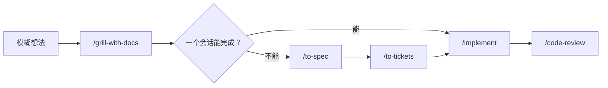

---
tags:
  - 主题
  - Agent
  - Codex
  - Skill
  - 软件工程
  - 教程
type: tutorial
source:
  - https://github.com/mattpocock/skills
created: 2026-08-01
---

# Matt Pocock Skills 实战教程

> 目标：把模糊想法稳定地推进为可验证的代码改动，而不是把所有任务都丢给“直接实现”。

## 一、先理解这套 Skills 的分工

这套 Skills 的核心是把工程工作拆成几个阶段：**对齐需求 → 形成规格 → 拆分可交付工单 → 实现与验证 → 复查**。



- **用户显式启动的 Skills**：用于切换阶段，例如 `/grill-with-docs`、`/to-spec`、`/implement`。
- **底层辅助 Skills**：通常由上层流程使用，例如 `/grilling`、`/domain-modeling`、`/tdd`。
- **按场景使用的 Skills**：例如 `/diagnosing-bugs`、`/handoff`、`/improve-codebase-architecture`。

官方将工程类技能列为日常代码工作流；其中 `grill-with-docs` 用于在改动前完成对齐并留下可复用的领域文档。详见 [mattpocock/skills](https://github.com/mattpocock/skills)。

## 二、首次在一个仓库中使用

先在目标代码仓库打开 Codex，再输入：

```text
/setup-matt-pocock-skills
```

它会配置以下项目级信息：

1. **Issue tracker**：GitHub、Linear 或本地 Markdown 文件。
2. **Triage 标签**：用于标识可由 agent 接手的工单。
3. **文档位置**：`CONTEXT.md` 与 ADR（Architecture Decision Record）的保存位置。

个人项目建议先选 **本地 Markdown tracker**：规格与工单会落在仓库中，便于版本控制和离线查看。团队已使用 GitHub/Linear 时则对接现有平台。

> 每个仓库只需初始化一次；换仓库后要重新运行。

## 三、最常用的主流程

### 1. `/grill-with-docs`：先把需求问清楚

**适用场景**

- 需求模糊，存在多个实现方向。
- 涉及业务术语、规则或难以回滚的决策。
- 开始一个新功能或较大改动。

**示例**

```text
/grill-with-docs 为 AI_Novels 增加“角色设定卡”功能：用户能创建、复用和绑定到作品。
```

**会发生什么**

- Agent 一次只提出一个关键问题，而不是一次发一整份问卷。
- 已能从代码库或现有文档确认的问题，会先自行查证。
- 已确定的术语会写入 `CONTEXT.md`；重要且难以逆转的取舍可记录为 ADR。

**何时结束**：当目标、范围、术语、边界条件和关键取舍都已明确。不要在 grilling 中急于要求编码。

### 2. `/to-spec`：把已讨论内容固化成规格

**适用场景**：需求已经谈清，但工作会跨多个模块、多个会话或多人协作。

```text
/to-spec
```

它不应重新采访你，而应基于当前对话和代码库生成规格。规格通常包含：问题陈述、方案、用户故事、实现决策、测试决策、非目标与补充说明。

**使用要点**

- 在 `grill-with-docs` 结束后、仍保留同一上下文时调用。
- 它会先确认测试 seam（能从外部行为验证的切入点）是否合理。
- 不要在规格里塞入具体文件路径或大量代码片段；这些信息容易过期。

### 3. `/to-tickets`：拆成能独立验证的纵向切片

**适用场景**：已有规格，需要拆成可逐张实施的工单。

```text
/to-tickets <规格文件路径、Issue URL 或编号>
```

每张工单都应该是一个 **tracer bullet（纵向切片）**：从数据、接口、UI 到测试，完成一条可验证的完整路径，而不是“先改数据库、再改接口、最后改 UI”这种横向分层任务。

在真正发布工单前，它会先展示：

- 标题
- 被哪些工单阻塞
- 该工单交付的端到端行为

此时重点检查：粒度是否过大、依赖关系是否真实、是否能单独演示或验证。

### 4. `/implement`：一次实施一张工单

**适用场景**：已有明确的规格或工单。

```text
/implement .scratch/role-cards/issues/01-create-role-card.md
```

推荐实践：

1. 每张工单使用一个相对干净的新会话。
2. 先阅读工单和相关领域文档，再开始改动。
3. 在合适的 seam 上执行 `/tdd`：先让行为测试失败，再实现，再重构。
4. 持续运行类型检查与局部测试；结束时运行适用的完整验证。
5. 完成实现后使用 `/code-review`。

> 提交、推送和部署属于不可逆动作，应按项目约定和你的授权流程执行。

### 5. `/code-review`：从“规范”和“规格”两条轴复查

**适用场景**：功能完成、准备合并，或想检查某分支/PR 的工作。

```text
/code-review main
```

这里的 `main` 是固定比较点；也可以传分支名、tag、commit SHA 或 `HEAD~5`。它会以 `git diff main...HEAD` 为范围，分别检查：

- **Standards**：是否符合仓库编码规范，并识别有判断空间的代码坏味道。
- **Spec**：是否满足原始规格，是否漏项、实现错误或范围蔓延。

这两份结果应分别阅读：代码风格合格不代表实现了正确需求，反之亦然。

## 四、按场景选择 Skill

| 场景                   | 首选 Skill                         | 示例                                     |     |
| -------------------- | -------------------------------- | -------------------------------------- | --- |
| 不知道下一步怎么走            | `/ask-matt`                      | `/ask-matt 我有一份 PRD，接下来应该做什么？`         |     |
| 新功能、规则尚不清楚           | `/grill-with-docs`               | `/grill-with-docs …`                   |     |
| 已有讨论，需形成正式规格         | `/to-spec`                       | `/to-spec`                             |     |
| 规格需拆分为可实施工作          | `/to-tickets`                    | `/to-tickets <spec>`                   |     |
| 已选定工单，需要开发           | `/implement`                     | `/implement <ticket>`                  |     |
| 要测试先行开发某个行为          | `/tdd`                           | `/tdd 为章节排序编写行为测试`                     |     |
| 难复现、间歇性或性能问题         | `/diagnosing-bugs`               | `/diagnosing-bugs 导出含图片的章节偶发失败；复现步骤是…` |     |
| 当前会话需要交给新会话继续        | `/handoff`                       | `/handoff 下一会话继续实现角色设定卡的第 2 张工单`       |     |
| 想找出长期积累的架构摩擦         | `/improve-codebase-architecture` | `/improve-codebase-architecture`       |     |
| 设计模块接口、测试 seam 或重构形态 | `/codebase-design`               | `请使用 codebase-design 设计素材库模块`          |     |
| 巨大且路径不清晰的项目          | `/wayfinder`                     | `/wayfinder 规划多租户迁移`                   |     |
|                      |                                  |                                        |     |

## 五、几个容易混淆的选择

### `grill-with-docs` 与 `wayfinder`

- **`grill-with-docs`**：适合一个会话仍能完整讨论清楚的需求；它的结果是清晰术语和决策。
- **`wayfinder`**：适合跨多个会话、尚无法准确拆工单的大型未知工作；它先建立“决策地图”，清除不确定性后再回到 `/to-spec → /to-tickets`。

普通功能优先使用 `grill-with-docs`，不要把 `wayfinder` 当默认入口。

### `diagnosing-bugs` 与“直接修 Bug”

遇到顽固问题时，先这样说：

```text
/diagnosing-bugs 用户反馈导出 PDF 时偶发空白页；发生频率约 5%，已知日志和复现步骤如下：…
```

这个流程最看重 **tight feedback loop**：一个能稳定触发并判定该问题的命令、测试或脚本。先构造“会红”的信号，再提出假设、加最少量观测、修复并添加回归测试。没有可重复信号时，不应凭直觉不断改代码。

### `/handoff` 与压缩上下文

- **`/handoff`**：生成一份交接文档，供**新会话**读取；适用于换线程、拆分原型探索或上下文接近上限。交接文档保存在操作系统临时目录，需保留输出的绝对路径。
- **压缩上下文**：继续同一个会话，只保留摘要；适合阶段之间的自然断点。

不要在需求澄清、规格和拆工单的中间阶段切断上下文，否则后续产物会丢失关键决策依据。

## 六、完整演练：新增“角色设定卡”

```text
1. /grill-with-docs 为 AI_Novels 增加角色设定卡：可创建、复用、绑定作品，并在生成时作为上下文。
2. （逐题确认范围、权限、数据迁移、提示词注入方式、测试 seam）
3. /to-spec
4. /to-tickets <刚创建的规格>
5. （确认每张纵向工单与阻塞关系）
6. /implement <第一张没有阻塞的工单>
7. /code-review main
8. /implement <下一张已解除阻塞的工单>
```

如果在第 2 步发现“角色卡内容是否真的能提升生成质量”无法只靠讨论决定，使用 `/handoff` 新开会话做一个 `/prototype`，带着实验结论回到主流程，再继续生成规格。

## 七、维护节奏

- **每次需求变更**：优先 `/grill-with-docs`。
- **每张工单**：`/implement`，并在结束时 `/code-review`。
- **每次遇到顽固缺陷**：`/diagnosing-bugs`，先构建可重复反馈环。
- **会话准备切换时**：`/handoff`。
- **每隔几天或感到项目变难改时**：`/improve-codebase-architecture`，选择一个最有杠杆的 deepening opportunity，再回到主流程。

## 八、速查卡

```text
新想法         → /grill-with-docs
需求已谈清     → /to-spec
规格要拆工单   → /to-tickets
开始做一张工单 → /implement <ticket>
完成后复查     → /code-review main
顽固 Bug       → /diagnosing-bugs <现象与复现>
要换会话       → /handoff <下一会话目标>
架构变复杂     → /improve-codebase-architecture
不知选哪个     → /ask-matt <当前状态>
```

## 相关笔记

- [[Agentic CLI 总览]]
- [[技能、插件与扩展机制]]
- [[多代理协作]]
