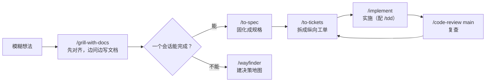

---
tags:
  - 主题
  - Agent
  - Skill
  - 教程
type: tutorial
created: 2026-08-05
updated: 2026-09-09
---

# 技能库使用手册

> 主线不变：一个功能从想法到合并，按这套技能走一遍——**对齐 → 规格 → 拆单 → 实施 → 复查**。2026-09-08 全面盘点后，技能库已从 25 个扩展到约 175 个（含官方插件）。工程工作流看 [[#三、主流程]]，内容营销三件套的完整说明书见 [[#四、内容营销三件套]]，全库地图看 [[#一、技能库全景]]。

## 一、技能库全景

按用途分 15 类（数量为当前会话实际加载的去重计数）：

| 类别          | 数量  | 技能                                                                                                                                                                                                                           | 一句话                                                               |
| ----------- | --- | ---------------------------------------------------------------------------------------------------------------------------------------------------------------------------------------------------------------------------- | ----------------------------------------------------------------- |
| 工程主流程       | 16  | setup-matt-pocock-skills、ask-matt、grill-with-docs、grilling、to-spec、to-tickets、implement、tdd、code-review、diagnosing-bugs、systematic-debugging、handoff、wayfinder、domain-modeling、codebase-design、improve-codebase-architecture | Matt Pocock 系列，核心工作流，见 [[#三、主流程]]                                 |
| 内容套件 blog   | 32  | blog + 31 个子技能                                                                                                                                                                                                               | 全生命周期博客引擎：写作、审计、集群、多语言、100 分评分                                    |
| 内容套件 seo    | 25  | seo + 24 个子技能                                                                                                                                                                                                                | 站点/单页 SEO 审计、技术 SEO、GEO（AI 搜索优化）                                  |
| 广告套件 ads    | 34  | ads + 33 个子技能                                                                                                                                                                                                                | 12 个平台付费投放的审计、策略、预算、创意、监控                                         |
| 可观测性与 SRE   | 7   | observability-and-instrumentation、distributed-tracing、prometheus-configuration、grafana-dashboards、slo-implementation、performance-optimization、agent-evals-and-observability                                                  | 日志/指标/追踪/告警/SLO/性能/Agent 评测，见 [[#五、可观测性与 SRE]]                                       |
| 文档与文件       | 6   | doc、pdf、document-skills:docx/pdf/pptx/xlsx、defuddle                                                                                                                                                                          | Office 全家桶 + 网页正文提取，交付前渲染验收，见 [[#七、文档与控制]]                                       |
| 前端设计        | 5   | design-taste-frontend、frontend-design、impeccable、ui-ux-pro-max、web-design-guidelines                                                                                                                                         | 从审美方向到合规审查，见 [[#六、前端：设计与最佳实践]]                                       |
| 前端最佳实践      | 9   | frontend-{accessibility,async,internationalization,js,react,react-router,tailwind,testing}-best-practices、rtl-aware-development                                                                                              | 写代码时自动参考的框架级守则，见 [[#六、前端：设计与最佳实践]]                                                    |
| 浏览器与桌面      | 4   | playwright、browser-use:control-browser、browser-use:web-gui-tester、computer-use                                                                                                                                               | 终端驱动浏览器 → 网页测试 → 桌面级控制，见 [[#七、文档与控制]]                                            |
| GitHub 插件   | 10  | github:commit/pr/issue/repo/gist/release/secret/codespace/setup/workflow-run                                                                                                                                                 | GitHub 全操作，见 [[#八、平台工具与元技能]]                                                        |
| 语言与代码质量     | 9   | effect、rust-skills、ruby-on-rails-best-practices、vercel-react-best-practices、sql-optimization、e2e-testing-patterns、owasp-security-check、modular-design-principles、skill-writing-best-practices                                | 各语言/领域的深度守则                                                       |
| 逆向工程        | 3   | protocol-reverse-engineering、reverse-engineering-android-malware-with-jadx、reverse-engineering-tools                                                                                                                         | 网络协议 / APK / 驱动反作弊（android-reverse-engineering 已修复待重启验证，见 [[#十一、加载机制]]） |
| Obsidian 笔记 | 4   | obsidian-markdown、obsidian-bases、obsidian-cli、json-canvas                                                                                                                                                                    | 读写 vault、.base 数据库视图、.canvas 白板，见 [[#八、平台工具与元技能]]                                   |
| 平台与元技能      | 9   | find-skills、skill-creator、agently-mail、zcode-guide:diagnosing-{commands,hooks,mcp,plugins,skills}、zcode-guide:zcode-configuration-guide                                                                                      | 找技能、造技能、收邮件、诊断宿主，见 [[#八、平台工具与元技能]]                                                  |
| 行为护栏        | 2   | stop-that-shit、stss                                                                                                                                                                                                          | 自动触发：拦截越界、去除文风对冲                                                  |

## 二、按场景选择（索引）

### 工程场景

| 场景 | 操作 | 备注 |
| ---- | ---- | ---- |
| 不知道下一步怎么走 | `/ask-matt` | 路由器，描述现状即可 |
| 新功能、规则不清楚 | `/grill-with-docs` | [[#1. `/grill-with-docs`：先把需求问清楚\|主流程 1]] |
| 讨论完要固化成规格 | `/to-spec` | [[#2. `/to-spec`：把已讨论内容固化成规格\|主流程 2]] |
| 规格拆成可实施工作 | `/to-tickets` | [[#3. `/to-tickets`：拆成能独立验证的工单\|主流程 3]] |
| 实施一张工单 | `/implement` | [[#4. `/implement`：一次实施一张工单\|主流程 4]] |
| 测试先行 | `/tdd` | [[#5. `/tdd`：测试先行\|主流程 5]] |
| 完成后复查 | `/code-review main` | [[#6. `/code-review`：从两条轴复查\|主流程 6]] |
| 难复现、间歇、性能问题 | `/diagnosing-bugs` | [[#7. 修顽固 Bug：`/diagnosing-bugs`\|主流程 7]] |
| 会话要交给别人继续 | `/handoff` | [[#8. `/handoff`：把当前会话交给新会话\|主流程 8]] |
| 项目巨大、路径不明 | `/wayfinder` | [[#`grill-with-docs` 与 `wayfinder`\|与 grill 的区别]] |
| 架构变复杂、难改 | `/improve-codebase-architecture` | 出 HTML 报告，挑一个深化 |
| 领域术语含混 | `/domain-modeling` | 自动维护 CONTEXT.md |
| 设计模块接口/seam | `/codebase-design` | 模块设计词汇 |

### 内容与营销场景

三个套件的完整说明书在 [[#四、内容营销三件套]]，这里只留最快入口：

| 场景 | 操作 | 备注 |
| ---- | ---- | ---- |
| 写/改/更新博文 | `/blog write`、`/blog rewrite`、`/blog update` | 旧文换数据走 update |
| 质量评分与站点体检 | `/blog analyze`、`/blog audit`、`/blog decay` | analyze 0–100 分，需 Python 3.11+ |
| 选题到大纲 | `/blog strategy`、`/blog calendar`、`/blog brief`、`/blog outline` | |
| 站点 SEO 审计 | `/seo audit`、`/seo page`、`/seo technical` | 首次先 `/seo setup` |
| AI 搜索优化 | `/seo geo`、`/seo sxo`、`/blog geo` | GEO/AEO、搜索体验 |
| 付费广告 | `/ads` | 12 平台总调度，账户变更需显式批准 |
| 提案文风去对冲 | `/stss` | 决策文书去掉防御性免责 |

### 平台与运维场景

Office 与界面控制的完整说明见 [[#七、文档与控制]]。

| 场景 | 操作 | 备注 |
| ---- | ---- | ---- |
| docx / PDF | `/doc`、`/pdf` | 渲染成图逐页检查 |
| PPT / Excel | `/pptx`、`/xlsx` | 仅插件版提供 |
| GitHub 提交/PR/issue | `/github:commit`、`/github:pr`、`/github:issue` | 短名 commit/pr/issue 亦可 |
| 发布版本、管密钥 | `/github:release`、`/github:secret` | |
| 真实浏览器操作 | `/playwright` | snapshot → 交互 → 截图循环 |
| 网页 GUI 测试 | `/web-gui-tester` | browser-use 插件 |
| 桌面应用自动化 | `/computer-use` | 无障碍树驱动，可后台操作 |
| 网页正文提取 | `/defuddle` | 替代 WebFetch，省 token |
| 指标采集/面板 | `/prometheus-configuration`、`/grafana-dashboards` | |
| 跨服务追踪 | `/distributed-tracing` | Jaeger / Tempo |
| SLI/SLO 与错误预算 | `/slo-implementation` | |
| 性能优化（全栈） | `/performance-optimization` | CWV、负载、慢查询 |
| Agent 评测与线上追踪 | `/agent-evals-and-observability` | 框架无关方法论 |
| 安全审计 | `/owasp-security-check` | OWASP Top 10 |
| 慢 SQL | `/sql-optimization` | 全数据库通用 |
| Rust / Rails / Effect | `/rust-skills`、`/ruby-on-rails-best-practices`、`/effect` | |
| Obsidian 笔记/白板 | `/obsidian-cli`、`/obsidian-markdown`、`/json-canvas` | 本手册就在 vault 里 |
| 收发邮件 | `/agently-mail` | 写操作两阶段确认 |
| 找/装新技能 | `/find-skills` | 先查 skills.sh 排行榜 |
| 造新技能 | `/skill-creator` | 配合 skill-writing-best-practices |
| 宿主技能/钩子/MCP 不生效 | `/zcode-guide:diagnosing-skills` 等 | diagnosing 系列按对象选 |

## 三、主流程：一个功能怎么走

### 0. 前置：初始化仓库（每仓库一次）

工程系列需要项目级的 issue tracker 和文档布局，每个仓库**跑一次**：

```text
/setup-matt-pocock-skills
```

它会配置三件事：

1. **Issue tracker**：选**本地 Markdown**（规格与工单落在 `.scratch/<feature-slug>/issues/`，便于版本控制）；团队已有 GitHub/Linear 则对接现有平台。
2. **Triage 标签**：标识可交给 agent 的工单（`ready-for-agent`）。
3. **文档位置**：`CONTEXT.md`（统一术语）+ `docs/adr/`（架构决策记录）。

E:\AI_Novels 与 F:\AI_Novels_OpenCode 均已初始化（`CONTEXT.md`、`docs/agents/issue-tracker.md` 齐备）。换新仓库后要重新运行。

### 主链路

核心是 Matt Pocock 工程系列：



- **主链路技能**（显式调用，切阶段用）：grill-with-docs、to-spec、to-tickets、implement、code-review、wayfinder、handoff。
- **实施中嵌入**：tdd（测试先行）、diagnosing-bugs / systematic-debugging（修 Bug）。
- **自动辅助**：domain-modeling（维护 CONTEXT.md 术语）、codebase-design（模块设计词汇），写作和设计时自动生效。
- **不知道用哪个**：`/ask-matt <当前状态>` 会给你推荐下一步。

### 1. `/grill-with-docs`：先把需求问清楚

**什么时候用**：需求模糊、有多个实现方向、涉及业务术语或难以回滚的决策。普通功能从这里开始。

```text
/grill-with-docs 为 AI_Novels 增加"角色设定卡"：用户能创建、复用并绑定到作品，生成时作为上下文。
```

**会发生什么**：

- 一次只问一个关键问题（不是一整份问卷），每个问题带推荐答案；
- 能从代码库/文档查证的事实会先自行查证；
- 已确定的术语立即写入 `CONTEXT.md`；难回滚的取舍记 ADR。

**何时结束**：目标、范围、术语、边界条件和关键取舍都已明确。**不要在 grilling 中催着编码**——这阶段的价值就是别做错方向。

### 2. `/to-spec`：把已讨论内容固化成规格

**什么时候用**：需求已谈清，但工作跨多个模块、多个会话或多人协作。在 grill 结束后**同一上下文**里调用，它不会重新采访你：

```text
/to-spec
```

**产出**：发布到 issue tracker 的规格文档（.scratch 下），含问题陈述、方案、用户故事清单、实现决策、测试决策、非目标。自动打上 `ready-for-agent`。

**要点**：

- 实现决策里**不写具体文件路径和代码片段**（容易过期）；
- 它会先和你确认测试 seam（从外部行为验证的切入点）是否合理。

### 3. `/to-tickets`：拆成能独立验证的工单

```text
/to-tickets <规格文件路径>
```

每张工单是一个 **tracer bullet（纵向切片）**：从数据、接口到 UI 和测试走通一条完整路径，而不是"先改数据库、再改接口、最后改 UI"的横向分层。

发布前会先展示每张工单的**标题、被谁阻塞、交付什么端到端行为**。此时重点检查：

- 粒度是否过大（一张工单应该一个会话能做完）；
- 依赖关系是否真实；
- 每张能否单独演示或验证。

### 4. `/implement`：一次实施一张工单

```text
/implement .scratch/role-cards/issues/01-create-role-card.md
```

推荐实践：

1. 每张工单用**相对干净的新会话**；
2. 先读工单和相关领域文档，再动代码；
3. 在合适的 seam 上执行 `/tdd`：先让行为测试失败，再实现，再重构；
4. 过程中持续跑类型检查与局部测试，结束时跑完整验证；
5. 完成后立即 `/code-review`。

> 提交、推送、部署是不可逆动作，按项目授权流程执行。

### 5. `/tdd`：测试先行

**什么时候用**：任何"行为"的开发（新功能、修 Bug），或你想先定义外部可见行为再实现。

```text
/tdd 为角色卡的分组排序编写行为测试
```

先看到测试红（失败），再实现让它变绿，最后重构。测试只测外部行为，不测实现细节。

### 6. `/code-review`：从两条轴复查

```text
/code-review main
```

`main` 是固定对比点，也可以传分支、tag、commit SHA 或 `HEAD~5`。以 `git diff main...HEAD` 为范围，**并行**跑两份检查：

- **Standards**：是否符合仓库编码规范，识别有判断空间的坏味道；
- **Spec**：是否满足原始规格，有没有漏项、实现错误或范围蔓延。

两份结果**分开读**：风格合格不代表需求做对了，反之亦然。

### 7. 修顽固 Bug：`/diagnosing-bugs`

**什么时候用**：难复现、间歇性或性能问题。**先这样说，别直接改**：

```text
/diagnosing-bugs 导出含图片的章节偶发失败，频率约 5%，复现步骤：……
```

核心是 **tight feedback loop**：先构造一个稳定触发并判定问题的命令/测试/脚本（先"红"），再提假设、加最少量观测、修复、补回归测试。没有可复现信号时不改代码。

> 顺手的小 Bug 也建议先 `/systematic-debugging`（系统化调试，先于任何修复）。

### 8. `/handoff`：把当前会话交给新会话

**什么时候用**：换线程、上下文接近上限、或拆出原型探索。

```text
/handoff 下一会话继续实现角色设定卡的第 2 张工单
```

它生成一份交接文档供**新会话**读取；文档保存在系统临时目录，**务必记下输出的绝对路径**。不要在需求澄清、规格、拆单的中间阶段切断上下文，否则产物会丢失决策依据。

## 四、内容营销三件套：blog / seo / ads

三个套件各管一段：`/blog` 管"写什么"，`/seo` 管"怎么被搜到"，`/ads` 管"买多少流量"。入口技能都是总调度，直接用自然语言描述需求即可自动路由；下述子命令也都能单独调用。以下全部命令用法均核对过各套件的命令表（2026-09-09）。

### blog：全生命周期博客引擎

**结构与前置**：`/blog` 总调度 + 31 个子技能（`blog-chart` 仅内部调用，写作时自动触发）+ 12 套模板 + 5 个内部 agent；0–100 质量评分依赖 Python 3.11+。**新项目先跑 `/blog brand init`**——生成的 `BRAND.md`、`VOICE.md` 会被所有写作子技能自动加载，是语调一致的地基。

**写前：调研与规划**

- `/blog strategy <niche>`：赛道战略与选题灵感；
- `/blog calendar`：月度/季度编辑日历；
- `/blog brief <topic>` → `/blog outline <topic>`：内容简报 → SERP 信息大纲；
- `/blog discourse <topic>`：抓取近 30 天社区真实讨论生成 `DISCOURSE.md`（免 API）——写"大家实际在说什么"类文章前先跑；
- `/blog notebooklm <question>`：对 NotebookLM 溯源提问，答案带出处。

**写中**

- `/blog write <topic>`：从零成文；`/blog rewrite <file>`：重写优化；
- `/blog update <file>`：只刷新数据与事实（自动路由 rewrite）——**更新旧文走 update，别整篇重写**；
- `/blog persona create|list|use`：写作人格档案；`/blog style learn <paths>`：从 5–10 篇旧文学习作者声线，供 write 与 persona 共用。

**写后**

- `/blog analyze`：0–100 质量评分；`/blog seo-check <file>`：发布前 SEO 校验清单；
- `/blog factcheck <file>`：对照引用源核验统计数据；
- `/blog schema <file>`：JSON-LD 结构化标记；`/blog image generate|edit|setup`：Gemini 配图；
- `/blog geo <file>`：AI 引用就绪审计——目标是让 AI Overviews / ChatGPT 引用就先查它。

**分发与长期运维**

- `/blog repurpose <file>`：一稿改写成其他平台格式；`/blog audio generate|voices|setup`：博客朗读音频；
- `/blog audit [dir]`：站点健康评估；`/blog decay <现GSC导出> <往期GSC导出>`：标出 QoQ 流量跌超 20% 的衰减文章；
- `/blog cannibalization [dir]`：多篇互抢同一关键词的检测；
- `/blog taxonomy suggest|sync|audit`：跨 CMS 标签/分类治理；
- `/blog google`：PSI、CrUX、GSC、GA4、NLP、YouTube、关键词等 Google API 数据。

**多语言**：`/blog multilingual <topic> --languages <codes>`（写+译+本地化+hreflang 一条龙）；`/blog translate <file> --to <codes>`（保格式 SEO 翻译）；`/blog localize <file> --locale <code>`（文化深适配，内置 DACH/FR/ES/JA）；`/blog locale-audit <dir>`（完整性、hreflang、一致性 QA）。

**一篇文章的完整链路**：

```text
/blog brand init                          （项目首次，定语调）
/blog discourse "AI 小说写作工具"          （看真实讨论）
/blog brief "AI 小说写作工具横向对比"
/blog write "AI 小说写作工具横向对比"
/blog factcheck <file> → /blog schema <file> → /blog image generate
/blog analyze <file>                      （0–100 分，不达标回 rewrite）
/blog seo-check <file>                    （发布前清单）
发布后 → /blog repurpose <file>            （分发到其他平台）
```

### seo：搜索可见性诊断台

**结构与前置**：入口 `/seo <命令> <url>`，自动识别 SaaS、电商、本地、出版、代理等业态。**首次使用必须 `/seo setup`**——创建隔离的 Python 运行时和 Chromium；`/seo doctor` 只检查环境不改系统。注意：doctor 体检的是**技能自己的运行环境**，不是你的网站。

**诊断层**

- `/seo audit <url>`：全站审计，并行子代理分头执行；
- `/seo page <url>`：单页深挖；`/seo technical <url>`：9 大类技术审计（可抓取性、索引、Core Web Vitals 含 INP 等）；
- `/seo sitemap <url|generate>`：分析或生成站点地图；`/seo images <url|optimize>`：图片 SEO；
- `/seo schema <url>`：结构化标记的检测、校验、生成。

**内容层**

- `/seo content <url>`：E-E-A-T 与内容质量分析；
- `/seo content-brief <topic|url>`：带目标关键词、大纲、内链的 SEO 简报（与 `/blog brief` 分工：这份面向搜索，blog 那份面向品牌）；
- `/seo cluster <seed-keyword>`：基于 SERP 的语义聚类与内容架构；
- `/seo plan <业态>`：战略规划；`/seo programmatic`：程序化页面分析与规划。

**AI 搜索层**

- `/seo geo <url>`：AI Overviews / 生成引擎优化；
- `/seo sxo <url>`：搜索体验优化——页面类型分析、用户故事、画像；
- `/seo flow [stage]`：FLOW 框架（Find / Leverage / Optimize / Win / Local）证据型提示词。

**数据与监控层**

- `/seo google [command] <url>`：GSC、PageSpeed、CrUX、Indexing、GA4；
- `/seo backlinks <url>`：外链画像（免费 Moz/Bing/CC，付费接 DataForSEO）；
- `/seo drift baseline|compare|history <url>`：先存基线，之后任意时点对比漂移——**改版前后必跑**。

**本地与垂直**：`/seo local`（GBP、引用、评论、地图包）；`/seo maps`（geo-grid、GBP 审计）；`/seo ecommerce`（产品 schema、平台情报）；`/seo hreflang`（多地区标记）。

**扩展**（需第三方账号）：`/seo firecrawl`（全站爬取与站点映射）；`/seo dataforseo`（付费 SEO 数据）；`/seo image-gen`（SEO 配图生成）。

**典型链路**：`setup → audit → technical → content` 摸清现状与缺口 → 按缺口选 `cluster / content-brief / plan` 补内容 → `geo / sxo` 面向 AI 搜索 → `drift baseline` 留基线，之后定期 `drift compare`。

### ads：12 平台付费投放操作系统

**运作方式**：`/ads` 是总调度（conductor），开场先确认目标、商业模式、在投平台、地域、预算、转化定义、数据窗口和**账户操作权限**，再按需加载对应平台与工作流材料；所有结论必须能溯源到本次运行产出的证据。**读取与变更分离**：任何对广告账户的真实变更都要求显式批准。

**平台子技能**（12 个，可单独调用）：ads-google、ads-meta、ads-youtube、ads-linkedin、ads-tiktok、ads-microsoft、ads-apple、ads-amazon（零售媒体）、ads-reddit、ads-pinterest、ads-snapchat、ads-x。

**工作流子技能**（按投放生命周期，作用均已核实描述原文）：

| 阶段 | 子技能 | 实际作用 |
| ---- | ---- | ---- |
| 接入 | ads-setup、ads-dna | 客户/账户/凭据/变更护栏配置；从授权网站提取 public-safe 的品牌与 offer 档案 |
| 接手先审 | ads-audit、ads-competitor | 来源可溯的账户审计；竞对广告投放、素材、落地页与竞价信号调研 |
| 花钱前 | ads-plan、ads-budget、ads-research | 战略；预算与度量规划；刷新平台/API/政策/基准证据，处理过期声明 |
| 素材 | ads-creative、ads-generate、ads-photoshoot、ads-landing | 素材生产；按 brief+品牌档案生成广告图；权利干净的产品摄影变体；落地页审计（信息匹配、性能、表单、转化摩擦） |
| 上线与优化 | ads-launch、ads-optimize、ads-monitor、ads-test、ads-validate | 变更执行；优化与监控；实验设计（假设、随机化单位、样本量、护栏、决策规则）；合约与安全就绪校验 |
| 度量与复盘 | ads-report、ads-math、ads-attribution、ads-server-side-tracking | 报告；PPC 数学（CPA/ROAS/MER/盈亏平衡/LTV:CAC/预算预测）；跨平台归因审计（转化定义、GA4、MMP、线下转化）；服务端测量审计（sGTM、CAPI、事件去重、同意与哈希） |

**接手账户的推荐顺序**：`ads-setup → ads-audit → ads-attribution`——先搞清楚数据和归因可不可信，再谈 `ads-plan / ads-budget`，素材与上线放最后。

### 三件套协同

一篇内容资产的生命周期：`/blog` 生产 → `/seo` 保证被搜到 → `/seo geo` 保证被 AI 引用 → `/blog repurpose` 分发 → `/ads` 给关键内容买量 → `/ads-report` 与 `/blog decay` 复盘衰减 → 回到 `/blog update` 刷新。Google 数据有两个入口：`/blog google`（内容视角）与 `/seo google`（站点视角）。

## 五、可观测性与 SRE：七个技能的分工

这七个不是总调度式套件，而是各管一段的独立技能。一条主线串起来：**写代码时埋点 → 采集与追踪 → 看板 → 定目标 → 出问题再优化**。

### observability-and-instrumentation：埋点方法论（自动触发）

**真实作用**：给功能加生产可观测性——像写测试一样同步写遥测，不是上线后补。流程：先定义"什么算正常工作" → 为每个问题选对的信号（结构化日志 / 指标 / 分布式追踪 / 告警四类）→ 实现 → **验证遥测本身可用**。

**适用场景**：任何要上生产的功能；新增服务、端点、后台任务、外部集成；一次事故诊断太慢之后（"说不清发生了什么"）；评审含 I/O、重试、队列、跨服务调用的 PR。

**不适用**：正在发生的故障（转 diagnosing-bugs）；已量化的性能问题（转 performance-optimization）。

> 注意：其正文引用的 `debugging-and-error-recovery`、`shipping-and-launch` 技能本库未安装，对应场景用 diagnosing-bugs / systematic-debugging 替代。

### distributed-tracing：跨服务追踪（Jaeger / Tempo）

**真实作用**：在分布式系统里追踪一个请求经过的所有服务，看清延迟分布、依赖关系和故障点；可与日志关联（correlated logs）。

**适用场景**：调试微服务、分析请求流、搭建追踪基础设施。单体应用用不上它。

### prometheus-configuration：指标采集与告警

**真实作用**：配置 Prometheus 完成指标采集、存储、告警规则与基础设施/应用监控。

**适用场景**：搭建监控基础设施、配置指标采集、编写告警规则。

### grafana-dashboards：看板设计

**真实作用**：设计生产级 Grafana 看板，核心是设计原则而非画图操作：信息分层；服务看板用 **RED** 方法（Rate / Errors / Duration），资源看板用 **USE** 方法（Utilization / Saturation / Errors）；四类面板（stat、时序、表格、热图）与变量模板的用法。

**适用场景**：建监控面板，可视化应用、基础设施、业务指标。

### slo-implementation：可靠性目标与错误预算

**真实作用**：定义 SLI / SLO / SLA 层级；给出常见 SLI 类型（可用性 = 成功请求占比、延迟 = 低于阈值请求占比等）；选择合理的 SLO 目标；**错误预算 = 1 − SLO 目标**，以及预算烧完后的策略。

**适用场景**：建立可靠性目标、落地 SRE 实践、用错误预算仲裁"继续发版 vs 冻结保稳定"。

### performance-optimization：性能优化纪律

**真实作用**：一条纪律——**先测量再优化**。工作流：测量（Lighthouse / DevTools Performance 录制 / RUM web-vitals 库 / APM / 慢查询日志）→ 定位真瓶颈 → 修复 → 复测。内置 Core Web Vitals 目标值。

**适用场景**：规格带性能预算（加载时间、响应 SLA）；用户或监控报告慢；CWV 不达标；怀疑某次变更引入回归；大数据量 / 高流量功能。

**不适用**：没有测量证据的"感觉慢"——那是过早优化，它明确拒绝。

### agent-evals-and-observability：AI Agent 评测（框架中立）

**真实作用**：评测与观测 AI agent 的方法论，不绑框架和厂商。七步工作流：定义任务契约与不可接受结果 → 建不可变数据集（含来源、权限、污染风险声明）→ 选互补 grader（确定性检查 / 执行与环境检查 / 人工 / 模型评审）→ 同条件跑候选与基线 → 报告多维画像与不确定性（**不显著 ≠ 等价**）→ 风险分级发布门（安全、隐私、授权、副作用不可被平均掉）→ 生产最小化脱敏遥测，事故沉淀为案例。

**适用场景**：定义 agent 评测集、选 grader、对比模型或提示词版本、上线发布门、生产 trace 与隐私遥测。具体框架实现按需路由（pydantic-ai / langgraph 等）。

### 串起来用

```text
写功能时   → observability-and-instrumentation（埋点随代码走）
采集追踪   → prometheus-configuration + distributed-tracing
看板       → grafana-dashboards（RED 看服务，USE 看资源）
定目标     → slo-implementation（错误预算仲裁发版节奏）
出问题     → 性能类转 performance-optimization；功能故障转 diagnosing-bugs
AI agent   → 单独走 agent-evals-and-observability
```

## 六、前端：设计与最佳实践

两个阵营：**设计技能**决定「长什么样、好不好用」（5 件套），**最佳实践技能**约束「代码怎么写」（10 件）。设计类按「新建 → 打磨 → 审查」分工；最佳实践类写码时自动触发，一般不用显式调用。

### 设计五件套

**design-taste-frontend**：反 AI 模板味（anti-slop）的 landing page / portfolio / 改版专精。读 brief 先推断设计方向（"read the room"），核心机制：三档拨盘配置、**AI TELLS 禁用模式清单**（专治 LLM 味排版）、改版协议、暗色模式协议、性能与无障碍护栏。适合「要一眼不像模板」的活。

**frontend-design**：新建 UI 时的视觉方向与排版（React 官方风格指引）——做有意图的设计选择，拒绝默认样式。与 taste-skill 相比更「官方通用」，taste 更「反叛个性」。

**impeccable**：界面全生命周期打磨，23 个子命令分六类（已核对命令表）：

| 类别 | 子命令 | 作用 |
| ---- | ---- | ---- |
| Build | craft、shape、init、document、extract | 端到端做功能；写码前规划 UX/UI；建 PRODUCT.md/DESIGN.md；从现有代码反推设计文档；抽取 tokens 进设计系统 |
| Evaluate | critique、audit | 启发式评分的设计评审；技术检查（a11y、性能、响应式） |
| Refine | polish、bolder、quieter、distill、harden、onboard | 上线前最后一遍；加大/收敛视觉强度；去复杂度留本质；生产就绪（错误、i18n、边界）；首次运行与空状态 |
| Enhance | animate、colorize、typeset、layout、delight、overdrive | 动效、配色、字体层级、间距节奏、个性记忆点、突破常规 |
| Fix | clarify、adapt、optimize | UX 文案与错误信息；多设备适配；UI 性能 |
| Iterate | live | 浏览器里圈选元素生成变体的可视化模式 |

另有「AI slop test」与绝对禁令清单，写作时自动把关。

**ui-ux-pro-max**：设计智能检索库（web / mobile / desktop）。工作流：分析需求 → **生成设计系统**（新页面必经，支持 master + overrides 持久化）→ 按需搜索补充风格、配色、字体 → 栈指南。适合「不知道该什么风格」时找参照。

**web-design-guidelines**：纯审查——按 Web Interface Guidelines 清单逐项检查 UI 代码，"review my UI" 时触发。

**分工速记**：新建页面找 frontend-design 或 design-taste-frontend；持续迭代按症状挑 impeccable 子命令；找风格参考找 ui-ux-pro-max；上线前合规检查找 web-design-guidelines。

**新项目链路**：`impeccable init` 建设计文档 → design-taste-frontend 定方向 → ui-ux-pro-max 出设计系统 → 写码（最佳实践自动生效）→ `impeccable critique + audit` → web-design-guidelines 终检 → `impeccable polish` 收尾。

### 最佳实践十件（写码时自动参考）

| 技能 | 管什么 |
| ---- | ---- |
| vercel-react-best-practices | React/Next.js 性能，**70 条规则 8 类**（Vercel 工程团队维护，按影响力排序，可直接驱动自动化重构） |
| frontend-react-best-practices | React 渲染与打包模式优化 |
| frontend-js-best-practices | JS/TS 性能（循环、数据结构、热路径） |
| frontend-async-best-practices | async/await 与 Promise——消除瀑布、最大化并行 |
| frontend-react-router-best-practices | loader / action / 表单 / 路由数据流架构 |
| frontend-tailwind-best-practices | Tailwind 模式与约定 |
| frontend-accessibility-best-practices | 组件与表单无障碍（a11y） |
| frontend-testing-best-practices | E2E 优先、少 mock、测行为不测实现 |
| frontend-internationalization-best-practices | React Router 框架模式 i18n（remix-i18next） |
| rtl-aware-development | RTL/LTR 布局、滚动、图标、混排文本、Electron 标题栏 |

> 版本提示：`vercel-react-best-practices`（70 条）与 `react-best-practices`（69 条）是同一指南的新旧两版，新版多一条 `bundle-analyzable-paths` 规则。宿主会把两个名字都列出，**内容以 vercel 版为准**。

## 七、文档与控制

两类活：**Office 文件**（用户级 doc / pdf 两件 + 插件 document-skills 四件）与**界面控制**（playwright、browser-use 两件、computer-use，外加读网页的 defuddle）。全部命令与工作流核对自各 SKILL.md（2026-09-09）。

### docx：两条生产线

**用户级 `doc`**：以**渲染验证**为纲——python-docx 编辑，`soffice`/`pdftoppm` 或自带 render_docx.py（Poppler）转 PNG 逐页看；每次实质修改后重渲染复查；无法渲染时降级为文本提取并明示布局风险。适合改现有文档、对最终版式负责的交付。

**插件版 `document-skills:docx`**：读/改/创全家桶，以**生成规范**为纲——内置格式标准（正文 1.3 倍行距、CJK 正文首行缩进两字符、表格边距、图片只锁一边保比例），**两层验收**（生成中自检清单 + 成品渲染检查）；数学公式与图表有专门路径。

选型：从零生成规范文档走插件版（标准全）；修补已有文档或最终验收走用户级渲染流程。短名 `doc` 命中用户级、`docx` 命中插件版。

### pdf：同名双技能

**用户级 `pdf`**：三场景——读版式敏感的 PDF、reportlab 程序化生成、交付前渲染验证（Poppler）。

**插件版 `document-skills:pdf`**：文档生产工作台——Triage 分诊 → Briefing → 共享资产 → 内容规则；图表嵌入走 HTML/CSS 画图再 2× 截图（300dpi 等效）。

`pdf` 短名两边同名，需要明确时用全名 `document-skills:pdf`。

### pptx 与 xlsx：仅插件版

**`document-skills:pptx`**：设计最佳实践驱动——开做前先定三件事、配色与每页布局；**强偏好图示 / 流程图 / 数据图**（而非文字堆砌）；图文分层是关键项；CJK 字体专门处理；附一份「避开 AI 生成感」清单。

**`document-skills:xlsx`**：场景驱动工作台——Pre-Flight 意图门确认真实需求 → 强制文件加载规则 → **场景路由**（edit / analyze / convert / 从零创建；财务线覆盖 DCF、LBO、三表联动、敏感性分析、投行模型）→ 质量门 + 能力矩阵。

短名 `pptx`、`xlsx` 即插件版（用户级无对应）。

### 界面控制：从浏览器到桌面

**playwright**：终端脚本化驱动真实浏览器（playwright-cli，需 Node）。核心循环：`open → snapshot 拿稳定元素 ref → 按 ref 交互 → 导航或 DOM 大变后重新 snapshot`，随手截图 / pdf / trace 留证。推荐模式：表单填写提交、UI 流调试（trace 回放）、多标签作业。适合数据提取与可脚本化的固定流程。

**browser-use:control-browser**：会话式浏览器自动化。原则：**优先 snapshot 观察，必要时才截图**；支持录制视频；Playwright 快照看不见目标时有逃生通道（escape hatches）。适合长链路网页操作与过程取证。

**browser-use:web-gui-tester**：网页 GUI 测试方法论，四阶段——场景评估与用例规划 → 测试环境准备 → 「动作 → 观察」循环执行 → 输出测试结论。明确的测试任务点名它。

**computer-use**：桌面级控制（鼠标、键盘、窗口、原生应用）。核心纪律「**观察一次、动作一次、然后验证**」；无障碍元素优先，**后台操作不抢焦点**；app 名按用户原文逐字符复制（不翻译、不改写、不补全）。浏览器之外的本地软件靠它。

**defuddle**：读网页正文的默认入口——`defuddle parse <url> --md` 剥掉导航与杂物，输出干净 markdown 省 token，替代 WebFetch 的阅读场景。

### 选型速记

```text
生成规范 docx → document-skills:docx     改/验 docx → doc（渲染逐页看）
做 PPT → /pptx（仅插件）                 做 Excel → /xlsx（仅插件）
PDF 读写 → pdf / document-skills:pdf（同名，全名消歧）
脚本爬取/调试 → playwright               会话操作/录屏 → control-browser
网页测试 → web-gui-tester                桌面应用 → computer-use
读文章 → defuddle
```

## 八、平台工具与元技能

三组小工具：**GitHub 十件套**（插件）、**Obsidian 四件套**、**元技能**（找/造/诊断/邮件）。单个都小，合起来管"周边环境"。

### GitHub 插件十件套

全部走 gh CLI。设计特点：**边界极窄且互斥**——每个技能都声明「不用于什么」（commit 只管本地提交不碰 PR；issue 不管 PR；secret 不管普通环境变量；codespace 不是本地 clone），误路由概率低。认证出问题先找 setup。

| 场景 | 技能 | 作用 |
| ---- | ---- | ---- |
| 初次配置 | github:setup | 校验 gh 安装与认证，切换账户/主机——其余九件的入口前置 |
| 日常提交 | github:commit | 从暂存区生成 conventional commit（仅本地） |
| PR 流 | github:pr | 创建 / 列表 / 检出 / 评审 / 合并 PR |
| 事务跟踪 | github:issue | issue 增删查关 + label / milestone 管理 |
| 发布 | github:release | 发 release 并起草 changelog（区别于单纯打 tag） |
| 拉仓库 | github:repo | clone / fork，浏览器打开文件、分支、issue、设置 |
| 分享片段 | github:gist | gist 增删改查（公开 / 秘密） |
| CI | github:workflow-run | 触发、监听、重跑 Actions，检查运行结果 |
| 密钥 | github:secret | Actions secrets 管理（不暴露明文） |
| 远程开发 | github:codespace | Codespace 创建 / 连接 / 停止 / 删除 |

短名即可调用（commit、pr、issue 等），与其他插件技能同名冲突时用 `github:` 前缀。

### Obsidian 四件套

- **obsidian-markdown**：Obsidian 方言语法——wikilink、嵌入、callout、properties。写单篇笔记的语法规范（本手册即按它写的）。
- **obsidian-bases**：`.base` 数据库视图文件——schema（全局过滤器、公式属性、汇总、多视图）与过滤器语法，把文件夹变成可查询表格。
- **obsidian-cli**：CLI 读写 vault——命令参考、文件与 vault 定位、常用模式；还管插件开发（重载插件/主题）。**批量整理 vault 用它**。
- **json-canvas**：`.canvas` 白板——节点 / 边 / 颜色 / ID 生成、布局指南、校验清单。想法梳理、流程图。

组合：脚本化批量操作走 obsidian-cli；结构化检索加 obsidian-bases 视图；单篇语法查 obsidian-markdown；可视化推演用 json-canvas。

### 元技能：找、造、诊断、邮件

- **find-skills**：发现并安装新技能。先查 [skills.sh](https://skills.sh/) 排行榜（安装量 ≥ 1K、来源可信），再 `npx skills add <owner/repo@skill> -g -y`。
- **skill-creator**：生成合规的技能骨架，配 **skill-writing-best-practices** 的结构规范（name / description 字段要求——本手册修过的 android-reverse-engineering 缺 name、claude-blog-brain description 超长，就是反面教材）。
- **agently-mail**：邮件全操作（agently-cli）：发送、回复、转发、搜索、读附件、管收件箱。**写操作两阶段确认**，防提示注入。
- **zcode-guide:diagnosing-{skills,plugins,hooks,mcp,commands}**：宿主排障系列——技能不加载查 diagnosing-skills、插件问题查 diagnosing-plugins，以此类推；**zcode-configuration-guide** 是宿主配置总指南。

## 九、容易混淆的选择

### `grill-with-docs` 与 `grilling`

- **`grill-with-docs`**：边拷问边把术语写进 CONTEXT.md、决策记 ADR。**默认选它**。
- **`grilling`**：纯拷问不写文档；适合只想快速压力测试一个想法的场合。

### `grill-with-docs` 与 `wayfinder`

- **`grill-with-docs`**：一个会话仍能谈清的需求，结果是清晰术语和决策。
- **`wayfinder`**：跨多个会话、现在拆不出工单的巨型未知工作，先建"决策地图"清除不确定性，再回到 `to-spec → to-tickets`。普通功能别用，它不是默认入口。

### `to-spec` 与 `to-tickets`

- **`to-spec`**：产出**一份**规格（PRD），回答"做什么、为什么"。
- **`to-tickets`**：把规格**拆成多张**可独立验证的工单，回答"先做哪个、谁依赖谁"。

### `diagnosing-bugs` 与"直接修"

顽固问题一律先 `/diagnosing-bugs` 建反馈环；小问题可先 `/systematic-debugging`。两者都不是"凭直觉改代码"。

### 五个前端设计技能

完整分工、23 个 impeccable 子命令与设计链路见 [[#六、前端：设计与最佳实践]]。速记：新建页面找 frontend-design / design-taste-frontend；持续打磨找 impeccable；合规检查找 web-design-guidelines；找参考风格找 ui-ux-pro-max。

### `doc` / `pdf` 与 `document-skills:docx/pdf/pptx/xlsx`

两条生产线的完整对比见 [[#七、文档与控制]]。速记：pptx 和 xlsx **只有插件版有**；短名 `doc` 命中用户级、`docx` 命中插件版；`pdf` 同名，明确时用全名 `document-skills:pdf`。

### `playwright` 与 `browser-use` 与 `computer-use`

三种控制面的完整对比见 [[#七、文档与控制]]。速记：脚本化浏览器活找 playwright；网页测试找 web-gui-tester；桌面原生应用找 computer-use。

### `blog` / `seo` / `ads` 三件套边界

- **`blog`**：内容生产（写、改、审、译、配图）。
- **`seo`**：站点与页面的搜索可见性（技术审计、schema、GEO）。
- **`ads`**：付费流量（12 个平台的投放全流程）。
- 有交叉时以入口技能自动路由为准：`/blog` 管"写什么"，`/seo` 管"怎么被搜到"，`/ads` 管"买了多少流量"。

### 行为护栏：`stop-that-shit` 与 `stss`

- **`stop-that-shit`**：拦截 agent 越界——"只读/只回答/到此为止/别扩展范围"这类边界被突破时自动收紧。
- **`stss`**：改写决策文书，去掉防御性免责和堆叠对冲（"可能、或许、建议考虑"）。
- 两者都自动触发，一般不用显式调用。

## 十、完整演练：新增"角色设定卡"

```text
1. /setup-matt-pocock-skills        （首次进入仓库时）
2. /grill-with-docs 增加角色设定卡：可创建、复用、绑定作品，生成时作为上下文
3. （逐题确认范围、权限、数据迁移、提示词注入方式、测试 seam）
4. /to-spec
5. /to-tickets <刚生成的规格>
6. （确认每张纵向工单与阻塞关系）
7. /implement <第一张无阻塞工单>
8. /tdd 为角色卡的创建与绑定写行为测试
9. /code-review main
10. /implement <下一张已解除阻塞的工单>
```

若第 3 步发现"角色卡内容能否提升生成质量"无法只靠讨论决定，用 `/handoff` 开新会话做个原型实验，带结论回到主流程再生成规格。

## 十一、加载机制与维护

### 技能从哪里加载

以 ZCode 会话（2026-09-08 实测）为例，技能来自三处：

1. **用户主库** `C:\Users\TTW\.agents\skills\`——约 160 个目录，全部套件都在这里；
2. **宿主内置** `C:\Users\TTW\.zcode\skills\`——14 个，与主库大量同名重复（frontend-\*、owasp、rust、ui-ux-pro-max 等）；
3. **官方插件缓存** `C:\Users\TTW\.zcode\cli\plugins\cache\zcode-plugins-official\`——browser-use、computer-use、document-skills、github、skill-creator、zcode-guide 六个插件带技能；android-emulator、ios-simulator、restore-legacy-sessions 不带技能。

其他宿主（opencode / Codex）加载各自目录，集合不同，**以会话内实际技能列表为准**。技能列表在**启动时加载**，新装/更新需重启会话才可见。插件技能可用 `插件:技能` 全名调用，与用户级同名时（如 `pdf`）用全名消歧。

### 已安装但未加载（已修复，待重启验证）

2026-09-09 查实原因并已修复，**重启会话后确认是否恢复**：

- **`android-reverse-engineering`**（APK 解包提取 API）：缺 `name` 字段且用了规范外 `trigger:` 字段 → 已补 `name: android-reverse-engineering`、删除 `trigger` 行（其内容与 description 里的中文触发词重复，不丢信息）。
- **`claude-blog-brain`**（Obsidian 博客内容中枢）：description 1709 字符超 1024 上限 → 已去重压缩至 742 字符。

> 这两个技能若经 `npx skills add` 安装，`npx skills update` 可能用上游版本覆盖本地修复；每次更新后重查 frontmatter。

### 维护操作

- **检查/更新技能**：`npx skills check` / `npx skills update`，更新后**重启 agent** 生效。
- **主库一致性**：`.agents\skills` 是主库；`.zcode\skills` 里的同名拷贝以主库为准维护，避免两边漂移。已知冗余：`react-best-practices`（69 条）与 `vercel-react-best-practices`（70 条）是同一 Vercel 指南的新旧两版，**以 vercel 版为准**，旧版可在维护时删除。
- **找新技能**：`/find-skills` 先看 [skills.sh](https://skills.sh/) 排行榜（安装量 ≥ 1K、来源可信），再 `npx skills add <owner/repo@skill> -g -y`。
- **写自己的技能**：`/skill-creator` 生成骨架，遵循 skill-writing-best-practices 的结构规范。

## 十二、速查卡

```text
── 工程主流程 ──────────────────────────────
进新仓库       → /setup-matt-pocock-skills（每仓库一次）
新想法         → /grill-with-docs（一次一个问题，边问边写文档）
需求已谈清     → /to-spec（发布到 .scratch/<slug>/issues/）
规格要拆工单   → /to-tickets <spec>
做一张工单     → /implement <ticket>
测试先行       → /tdd
完成后复查     → /code-review main
顽固 Bug       → /diagnosing-bugs <现象与复现>（先建反馈环）
小 Bug         → /systematic-debugging
要换会话       → /handoff <下一会话目标>（记下临时文件路径）
项目太大       → /wayfinder（决策地图，只规划）
架构变复杂     → /improve-codebase-architecture
不知选哪个     → /ask-matt <当前状态>

── 前端 ────────────────────────────────────
落地页         → design-taste-frontend    界面打磨 → impeccable
新建 UI        → frontend-design          风格检索 → ui-ux-pro-max
UI 审查        → web-design-guidelines    React → vercel-react-best-practices

── 内容与营销 ──────────────────────────────
写博客         → /blog（自动路由 31 个子技能）
SEO 审计       → /seo audit <url>         GEO → /seo geo
广告投放       → /ads（12 平台，自动路由）

── 文档与控制 ──────────────────────────────
docx → doc    PDF → pdf    PPT → /pptx    Excel → /xlsx
浏览器 → playwright    桌面 → /computer-use    网页测试 → /web-gui-tester
GitHub → /github:pr / github:commit        邮件 → /agently-mail

── 平台与质量 ──────────────────────────────
指标/面板      → /prometheus-configuration + /grafana-dashboards
追踪 / SLO     → /distributed-tracing + /slo-implementation
性能 / 安全    → /performance-optimization + /owasp-security-check
慢 SQL         → /sql-optimization        Agent 评测 → /agent-evals-and-observability
Obsidian       → /obsidian-cli / obsidian-markdown / json-canvas
逆向           → protocol-reverse-engineering（协议）/ jadx（APK，已修复待重启验证：android-reverse-engineering）
找技能         → /find-skills             造技能 → /skill-creator
```

## 十三、维护日志

- **2026-09-09**：查实并**修复**两个未加载技能——`android-reverse-engineering` 补 `name`、删规范外 `trigger`；`claude-blog-brain` description 1709 → 742 字符（待重启验证加载）。工程索引表恢复主流程跳转链接；补 blog 品牌语调与内容分发入口。
- **2026-09-09（2）**：新增「四、内容营销三件套」完整说明书，全部命令逐一核对 blog/seo/ads 命令表；**纠正两处错误**——`/blog chart` 是内部专用技能不可直接调用；`/seo doctor` 是运行环境自检而非网站体检。索引表瘦身为快速入口；「初始化仓库」并入主流程作为第 0 步（后续章节编号各前移一位）。
- **2026-09-09（3）**：新增「五、可观测性与 SRE」说明书章节，七个技能逐一核对 SKILL.md 原文；记录 observability 技能引用的 `debugging-and-error-recovery`、`shipping-and-launch` 未安装及替代方案；后续章节编号顺延（易混→六、演练→七、加载→八、速查→九、日志→十）。
- **2026-09-09（4）**：新增「六、前端：设计与最佳实践」章节——impeccable 23 个子命令按六类列表（核对命令表）；**修正**：`react-best-practices`（69 条）与 `vercel-react-best-practices`（70 条）并非完全相同的拷贝，是新旧两版，以 vercel 版为准；易混章的前端小节改为指向新章节；章节顺延（易混→七、演练→八、加载→九、速查→十、日志→十一）。
- **2026-09-09（5）**：新增「七、文档与控制」章节——docx 两条生产线（用户级渲染验证 vs 插件版生成规范+两层验收）、pdf 同名双技能、pptx/xlsx 插件专属能力（场景路由含财务模型线）、playwright/browser-use/computer-use 三种控制面、defuddle 用法；易混章对应两小节改为指针；章节顺延（易混→八、演练→九、加载→十、速查→十一、日志→十二）。
- **2026-09-09（6）**：新增「八、平台工具与元技能」章节——GitHub 十件套按场景列表（指出其「边界窄且互斥、每件声明不用于什么」的设计）、Obsidian 四件套组合用法、元技能（find-skills / skill-creator / agently-mail / zcode-guide 排障系列）；章节顺延（易混→九、演练→十、加载→十一、速查→十二、日志→十三）。
- **2026-09-08**：全面盘点重写，25 → 约 175 个，改为「全景地图 + 三段场景索引」结构，加载机制按三处来源实测更正。

## 相关笔记

- [[Agentic CLI 总览]]
- [[技能、插件与扩展机制]]
- [[Matt Pocock Skills 实战教程]]
- [[多代理协作]]
