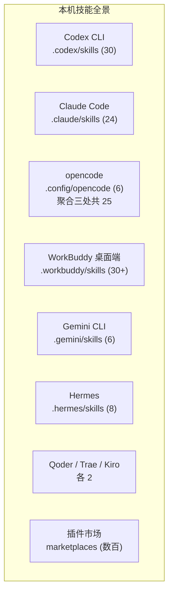
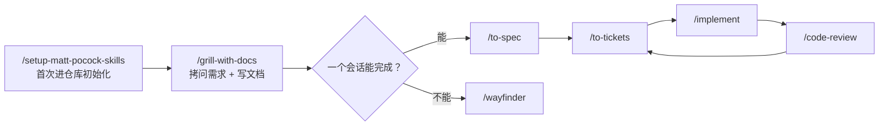

---
tags:
  - 主题
  - Agent
  - Skill
  - 教程
type: tutorial
created: 2026-08-05
---

# 技能库使用手册

> 目标：知道**全机器有哪些技能、各自属于哪个 agent 生态、什么场景用哪个、如何安装与维护**。技能（Skills）是 agent 的"专业手册"——命中场景时自动加载，不命中时完全不参与对话。

## 一、技能库全景

先澄清一个关键事实：**每个 agent 只加载自己目录下的技能**。本机技能分散在 **9+ 个 agent 生态**中，去重后超过 **70 个用户技能**（不含插件市场的数百个备选）：



- **通用 6 件套**（doc / find-skills / pdf / playwright / react-best-practices / web-design-guidelines）在多个生态都有副本，是"一份技能、到处通用"。
- **Matt Pocock 工程系列**是主心骨：`.codex/skills` 和 `.workbuddy/skills/codex` 各有一份完整版（17 个），其余生态只散布部分（grilling、to-spec、wayfinder 等）。
- **逆向工程 4 件套**只装在 `.codex/skills`。
- **WorkBuddy 桌面端**独占 aihot、qqmusic、imagegen、computer-use 等插件技能。

## 二、按 agent 生态分布

| 生态 | 技能目录 | 数量 | 主要内容 |
| --- | --- | --- | --- |
| **Codex CLI** | `C:\Users\TTW\.codex\skills` | 30 | Matt Pocock 全套 17 个 + 通用 8 个 + **逆向工程 4 个** + 系统 2 个（imagegen、skill-installer 等 6 个内置） |
| **Codex / 通用** | `C:\Users\TTW\.agents\skills` | 9 | agently-mail + 通用 6 件套 + to-spec、wayfinder |
| **Claude Code** | `C:\Users\TTW\.claude\skills` | 24 | 通用 6 件套 + design-taste-frontend、impeccable + **Matt 工程系列全套 16 个**（2026-08-05 补齐） |
| **opencode** | `C:\Users\TTW\.config\opencode\skills` | 6 | 通用 6 件套 |
| **WorkBuddy 桌面端** | `C:\Users\TTW\.workbuddy\skills` | 30+ | `codex/`（Matt Pocock 全套 24）+ `codex-system/`（内置 6）+ aihot、qqmusic、agently-mail + `plugins/`（computer-use、visualize、spreadsheets、data-analytics、product-design、sales 等） |
| **Gemini CLI** | `C:\Users\TTW\.gemini\skills` | 6 | 通用 6 件套 |
| **Hermes** | `C:\Users\TTW\.hermes\skills` | 8 | 通用 6 件套 + to-spec、wayfinder |
| **Qoder / Trae / Kiro** | 各自 `skills\` | 各 2 | to-spec、wayfinder |
| **插件市场** | `.workbuddy\plugins\marketplaces\` | 数百 | codebuddy-plugins-official（scientific-skills 100+、superpowers、hot-skills、godot 系列、docx/pptx/xlsx）、experts（微信公众平台专家、senior-developer）等，安装后才生效 |

> **为什么 opencode 里只有 25 个（旧会话仍显示 15）**：opencode 聚合 `.agents`、`.claude`、`.config/opencode` 三处；`.codex`、`.gemini`、`.workbuddy` 等目录的技能要打开对应工具才生效。技能列表在**启动时加载**，补齐 `.claude` 后需重启 opencode 会话才能看到新增的 10 个工程技能。

## 三、核心技能详解

### A. 工程工作流（主心骨，来自 mattpocock/skills）

完整链路：**初始化 → 对齐 → 规格 → 拆单 → 实施 → 复查**，附诊断、交接与路由：



**按环节使用：**

| 环节 | 技能 | 说明 | 触发 |
| --- | --- | --- | --- |
| 初始化 | `/setup-matt-pocock-skills` | 配置 issue tracker、triage 标签、文档布局；每个仓库跑一次 | 显式 |
| 对齐需求 | `/grill-with-docs` | 一次一个问题（附推荐答案），边问边写 CONTEXT.md 术语和 ADR；比纯 `grilling` 多产出文档 | 显式 |
| 对齐（轻量） | `/grilling` | 纯拷问，不写文档 | 显式或 "grill" 触发 |
| 形成规格 | `/to-spec` | 基于已有对话合成 PRD（不重新采访），发到 issue tracker | 显式 |
| 拆工单 | `/to-tickets` | 拆成 tracer-bullet 纵向切片，声明阻塞关系 | 显式 |
| 巨型规划 | `/wayfinder` | 跨会话大工程的"决策地图"，只规划不做 | 显式 |
| 实施 | `/implement` | 按规格/工单实施 | 显式 |
| 测试先行 | `/tdd` | red-green-refactor，行为测试先行 | 显式 |
| 复查 | `/code-review` | 两条轴并行复查：Standards（规范）+ Spec（规格） | 显式 |
| 顽固 Bug | `/diagnosing-bugs` | 先建可复现反馈环再修，禁止凭直觉改 | 显式 |
| 任何 Bug | `/systematic-debugging` | 系统化调试流程，先于任何修复 | 自动/显式 |
| 换会话 | `/handoff` | 生成交接文档给新会话 | 显式 |
| 不知选哪个 | `/ask-matt` | 技能路由，描述现状它会推荐流程 | 显式 |
| 领域建模 | `/domain-modeling` | 治理 CONTEXT.md 术语、按需提议 ADR | 自动 |
| 模块设计 | `/codebase-design` | deep module 词汇：module/interface/depth/seam/adapter/leverage/locality | 显式 |
| 架构复查 | `/improve-codebase-architecture` | 找浅模块，出 HTML 报告，再 grilling 深化 | 显式 |

> 仓库约定（E:\AI_Novels）：issue tracker 为本地 Markdown（`.scratch/<feature-slug>/issues/`），领域文档为 `CONTEXT.md` + `docs/adr/`。详见 [[Matt Pocock Skills 实战教程]]。

### B. 前端设计

| 技能 | 一句话 | 适用 | 位置 |
| --- | --- | --- | --- |
| `/design-taste-frontend`（同 `taste-skill`） | 反模板化落地页 | landing page、portfolio、redesign；三拨盘 VARIANCE/MOTION/DENSITY | .claude / .codex / .workbuddy |
| `/impeccable` | 生产级前端全面迭代 | 任何前端界面，含 setup 流程与子命令（craft/shape/audit/polish） | .claude / .codex / .workbuddy |
| `/web-design-guidelines` | UI 合规审查 | "review my UI"，每次拉最新 Vercel 规则，输出 file:line | 全生态 |
| `/react-best-practices` | React/Next.js 性能守则 | 69 条规则 8 优先级，写 React 时自动参考 | 全生态 |

### C. 文档与格式

| 技能 | 用途 | 要点 | 位置 |
| --- | --- | --- | --- |
| `/doc` | `.docx` 读写 | python-docx + LibreOffice 渲染成图逐页检查 | 全生态 |
| `/pdf` | PDF 生成/提取 | reportlab + pdfplumber + Poppler 渲染检查 | 全生态 |
| `/spreadsheets`、`/excel-live-control` | Excel 处理 | OpenAI 运行时内置，仅 WorkBuddy | .workbuddy/plugins |
| `/presentations`、`/pptx` | PPT 生成 | 同上 | .workbuddy/plugins |
| `/xlsx`、`/docx`、`/ppt-writer` 等 | 微软三件套 | CodeBuddy 插件市场 | marketplaces |

### D. 自动化与日常工具

| 技能 | 用途 | 位置 |
| --- | --- | --- |
| `/playwright` | 终端驱动真实浏览器（snapshot→click→截图循环） | 全生态 |
| `/agently-mail` | 收发邮件（QQ 邮箱，两阶段确认 + 邮件防注入） | .agents / .workbuddy |
| `/aihot` | 查 AI 热点资讯、日报（匿名只读 API，不凭记忆） | .workbuddy |
| `/qqmusic` | 搜歌、每日推荐、排行榜、AI 歌单 | .workbuddy |
| `/imagegen` | 生成图片（OpenAI 内置） | .codex / .workbuddy |
| `/computer-use`、`/control-chrome`、`/control-in-app-browser` | 桌面/浏览器自动化（OpenAI 运行时） | .workbuddy/plugins |
| `/documents`、`/template-creator`、`/visualize` | 文档模板与可视化 | .workbuddy/plugins |

### E. 逆向工程（仅 Codex）

- `/android-reverse-engineering`：jadx/Fernflower 反编译 APK/XAPK/JAR/AAR，提取 HTTP API（Retrofit/OkHttp/Volley），UI→网络层调用链追踪。
- `/protocol-reverse-engineering`、`/reverse-engineering-tools`、`/reverse-engineering-android-malware-with-jadx`：协议与工具链配套。

## 四、按场景选择

| 场景 | 首选技能 | 示例 |
| --- | --- | --- |
| 新仓库首次使用工程流程 | `/setup-matt-pocock-skills` | 进仓库后先跑一次 |
| 需求模糊，先对齐 | `/grill-with-docs` | `为角色设定卡功能先理清需求` |
| 已有讨论，需固化规格 | `/to-spec` | `/to-spec` |
| 规格拆工单 | `/to-tickets` | `/to-tickets <spec>` |
| 实施一张工单 | `/implement` | `/implement <ticket>` |
| 测试先行 | `/tdd` | `为章节排序写行为测试` |
| 完成后复查 | `/code-review main` | 对比点可以是分支/tag/SHA |
| 顽固 Bug | `/diagnosing-bugs` | 先给复现步骤 |
| 换会话继续 | `/handoff` | `下一会话继续实现第 2 张工单` |
| 巨型未知项目 | `/wayfinder` | `规划多租户迁移` |
| 架构变复杂 | `/improve-codebase-architecture` | 出 HTML 报告挑一个深化 |
| 领域术语混乱 | `/domain-modeling` | 写入 CONTEXT.md |
| 设计模块接口 | `/codebase-design` | `设计素材库模块` |
| 落地页/改版 | `/design-taste-frontend` | `做个不像模板的 SaaS 落地页` |
| 界面打磨/审计 | `/impeccable` | `/impeccable audit ...` |
| UI 合规审查 | `/web-design-guidelines` | `review my UI` |
| React 性能 | `/react-best-practices` | 自动参考 |
| docx / PDF | `/doc` / `/pdf` | 渲染后视觉检查 |
| 真实浏览器 | `/playwright` | `走一遍注册流程并截图` |
| 收发邮件 | `/agently-mail` | 写操作需两阶段确认 |
| 反编译 APK / 提取 API | `/android-reverse-engineering` | `反编译这个 APK 找出登录接口` |
| 查 AI 资讯 | `/aihot` | `今天 AI 圈有什么大事` |
| 听歌/找歌 | `/qqmusic` | `推荐今天的歌单` |
| 找/装新技能 | `/find-skills` | `有生成 changelog 的技能吗？` |

## 五、分布与重复情况

同一技能在多个生态各有副本（安装分发所致），**内容一致**：

- **通用 6 件套**：doc、find-skills、pdf、playwright、react-best-practices、web-design-guidelines —— 出现在 `.codex`、`.agents`、`.claude`、`.config/opencode`、`.gemini`、`.hermes` 全部生态（已验证哈希一致）。
- **Matt Pocock 系列**：`.codex/skills`、`.workbuddy/skills/codex`、`.claude/skills` 各一份完整版（已哈希验证一致，`.codex` 与 `.workbuddy` 完全相同）；`.agents`/`.hermes`/`.qoder`/`.trae`/`.kiro` 只有 to-spec、wayfinder 等散件（内容一致，仅行尾符差异）。
- **特殊件**：design-taste-frontend（.claude）、逆向工程 4 件套（.codex）、aihot/qqmusic（.workbuddy）为独占。

**2026-08-05 补齐记录**：`.claude/skills` 从 `.codex/skills` 复制缺失的 12 个工程技能（ask-matt、code-review、diagnosing-bugs、grill-with-docs、handoff、implement、setup-matt-pocock-skills、systematic-debugging、tdd、to-spec、to-tickets、wayfinder），纯新增未覆盖任何现有文件，复制后哈希与原库一致；taste-skill 未复制（.claude 已有同源 design-taste-frontend）。

**同步建议**：升级某生态的共享技能时，注意把其他生态的副本一起更新，避免版本漂移。

## 六、维护与扩展

- **发现新技能**：`/find-skills` 先查 [skills.sh](https://skills.sh/) 排行榜（要求安装量 ≥ 1K、来源可信），再 `npx skills add <owner/repo@skill> -g -y`。
- **更新**：`npx skills check` / `npx skills update`；`agently-mail` 出现更新提示时按提示升级并重启 agent。
- **WorkBuddy 插件市场**：在 CodeBuddy/WorkBuddy 客户端内安装插件，技能自动落到 `.workbuddy/skills/plugins`。
- **重复副本**：当前为"多生态独立副本"模式；若想收敛为单一共享目录，需先确认各 CLI 的加载规则，属于有风险的结构变更，动手前先评估。

## 七、速查卡

```text
进新仓库     → setup-matt-pocock-skills
想法模糊     → grill-with-docs（一次一个问题，边问边写文档）
需求已谈清   → to-spec（发布到 issue tracker）
规格拆工单   → to-tickets（tracer-bullet 纵向切片）
做一张工单   → implement <ticket>
测试先行     → tdd       复查        → code-review main
顽固 Bug     → diagnosing-bugs    任何 Bug → systematic-debugging
换会话       → handoff
项目太大     → wayfinder  架构变复杂 → improve-codebase-architecture
术语含混     → domain-modeling    模块设计 → codebase-design
不知选哪个   → ask-matt
落地页       → design-taste-frontend    界面打磨 → impeccable
UI 审查      → web-design-guidelines    React → react-best-practices
docx → doc   PDF → pdf   浏览器 → playwright   邮件 → agently-mail
逆向        → android-reverse-engineering
AI 资讯     → aihot       音乐 → qqmusic     找技能 → find-skills
```

## 相关笔记

- [[Agentic CLI 总览]]
- [[技能、插件与扩展机制]]
- [[Matt Pocock Skills 实战教程]]
- [[多代理协作]]
