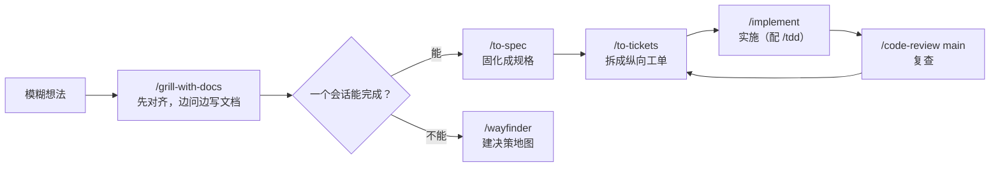

---
tags:
  - 主题
  - Agent
  - Skill
  - 教程
type: tutorial
created: 2026-08-05
updated: 2026-09-09
---

# 技能库使用手册

> 主线不变：一个功能从想法到合并，按这套技能走一遍——**对齐 → 规格 → 拆单 → 实施 → 复查**。2026-09-08 全面盘点后，技能库已从 25 个扩展到约 175 个（含官方插件）。工程工作流看 [[#三、主流程]]，内容营销三件套的完整说明书见 [[#四、内容营销三件套]]，全库地图看 [[#一、技能库全景]]。

## 一、技能库全景

按用途分 15 类（数量为当前会话实际加载的去重计数）：

| 类别          | 数量  | 技能                                                                                                                                                                                                                           | 一句话                                                               |
| ----------- | --- | ---------------------------------------------------------------------------------------------------------------------------------------------------------------------------------------------------------------------------- | ----------------------------------------------------------------- |
| 工程主流程       | 16  | setup-matt-pocock-skills、ask-matt、grill-with-docs、grilling、to-spec、to-tickets、implement、tdd、code-review、diagnosing-bugs、systematic-debugging、handoff、wayfinder、domain-modeling、codebase-design、improve-codebase-architecture | Matt Pocock 系列，核心工作流，见 [[#三、主流程]]                                 |
| 内容套件 blog   | 32  | blog + 31 个子技能                                                                                                                                                                                                               | 全生命周期博客引擎：写作、审计、集群、多语言、100 分评分                                    |
| 内容套件 seo    | 25  | seo + 24 个子技能                                                                                                                                                                                                                | 站点/单页 SEO 审计、技术 SEO、GEO（AI 搜索优化）                                  |
| 广告套件 ads    | 34  | ads + 33 个子技能                                                                                                                                                                                                                | 12 个平台付费投放的审计、策略、预算、创意、监控                                         |
| 可观测性与 SRE   | 7   | observability-and-instrumentation、distributed-tracing、prometheus-configuration、grafana-dashboards、slo-implementation、performance-optimization、agent-evals-and-observability                                                  | 日志/指标/追踪/告警/SLO/性能/Agent 评测                                       |
| 文档与文件       | 6   | doc、pdf、document-skills:docx/pdf/pptx/xlsx、defuddle                                                                                                                                                                          | Office 全家桶 + 网页正文提取，交付前渲染验收                                       |
| 前端设计        | 5   | design-taste-frontend、frontend-design、impeccable、ui-ux-pro-max、web-design-guidelines                                                                                                                                         | 从审美方向到合规审查，见 [[#五、容易混淆的选择]]                                       |
| 前端最佳实践      | 9   | frontend-{accessibility,async,internationalization,js,react,react-router,tailwind,testing}-best-practices、rtl-aware-development                                                                                              | 写代码时自动参考的框架级守则                                                    |
| 浏览器与桌面      | 4   | playwright、browser-use:control-browser、browser-use:web-gui-tester、computer-use                                                                                                                                               | 终端驱动浏览器 → 网页测试 → 桌面级控制                                            |
| GitHub 插件   | 10  | github:commit/pr/issue/repo/gist/release/secret/codespace/setup/workflow-run                                                                                                                                                 | GitHub 全操作                                                        |
| 语言与代码质量     | 9   | effect、rust-skills、ruby-on-rails-best-practices、vercel-react-best-practices、sql-optimization、e2e-testing-patterns、owasp-security-check、modular-design-principles、skill-writing-best-practices                                | 各语言/领域的深度守则                                                       |
| 逆向工程        | 3   | protocol-reverse-engineering、reverse-engineering-android-malware-with-jadx、reverse-engineering-tools                                                                                                                         | 网络协议 / APK / 驱动反作弊（android-reverse-engineering 已修复待重启验证，见 [[#七、加载机制]]） |
| Obsidian 笔记 | 4   | obsidian-markdown、obsidian-bases、obsidian-cli、json-canvas                                                                                                                                                                    | 读写 vault、.base 数据库视图、.canvas 白板                                   |
| 平台与元技能      | 9   | find-skills、skill-creator、agently-mail、zcode-guide:diagnosing-{commands,hooks,mcp,plugins,skills}、zcode-guide:zcode-configuration-guide                                                                                      | 找技能、造技能、收邮件、诊断宿主                                                  |
| 行为护栏        | 2   | stop-that-shit、stss                                                                                                                                                                                                          | 自动触发：拦截越界、去除文风对冲                                                  |

## 二、按场景选择（索引）

### 工程场景

| 场景 | 操作 | 备注 |
| ---- | ---- | ---- |
| 不知道下一步怎么走 | `/ask-matt` | 路由器，描述现状即可 |
| 新功能、规则不清楚 | `/grill-with-docs` | [[#1. `/grill-with-docs`：先把需求问清楚\|主流程 1]] |
| 讨论完要固化成规格 | `/to-spec` | [[#2. `/to-spec`：把已讨论内容固化成规格\|主流程 2]] |
| 规格拆成可实施工作 | `/to-tickets` | [[#3. `/to-tickets`：拆成能独立验证的工单\|主流程 3]] |
| 实施一张工单 | `/implement` | [[#4. `/implement`：一次实施一张工单\|主流程 4]] |
| 测试先行 | `/tdd` | [[#5. `/tdd`：测试先行\|主流程 5]] |
| 完成后复查 | `/code-review main` | [[#6. `/code-review`：从两条轴复查\|主流程 6]] |
| 难复现、间歇、性能问题 | `/diagnosing-bugs` | [[#7. 修顽固 Bug：`/diagnosing-bugs`\|主流程 7]] |
| 会话要交给别人继续 | `/handoff` | [[#8. `/handoff`：把当前会话交给新会话\|主流程 8]] |
| 项目巨大、路径不明 | `/wayfinder` | [[#`grill-with-docs` 与 `wayfinder`\|与 grill 的区别]] |
| 架构变复杂、难改 | `/improve-codebase-architecture` | 出 HTML 报告，挑一个深化 |
| 领域术语含混 | `/domain-modeling` | 自动维护 CONTEXT.md |
| 设计模块接口/seam | `/codebase-design` | 模块设计词汇 |

### 内容与营销场景

三个套件的完整说明书在 [[#四、内容营销三件套]]，这里只留最快入口：

| 场景 | 操作 | 备注 |
| ---- | ---- | ---- |
| 写/改/更新博文 | `/blog write`、`/blog rewrite`、`/blog update` | 旧文换数据走 update |
| 质量评分与站点体检 | `/blog analyze`、`/blog audit`、`/blog decay` | analyze 0–100 分，需 Python 3.11+ |
| 选题到大纲 | `/blog strategy`、`/blog calendar`、`/blog brief`、`/blog outline` | |
| 站点 SEO 审计 | `/seo audit`、`/seo page`、`/seo technical` | 首次先 `/seo setup` |
| AI 搜索优化 | `/seo geo`、`/seo sxo`、`/blog geo` | GEO/AEO、搜索体验 |
| 付费广告 | `/ads` | 12 平台总调度，账户变更需显式批准 |
| 提案文风去对冲 | `/stss` | 决策文书去掉防御性免责 |

### 平台与运维场景

| 场景 | 操作 | 备注 |
| ---- | ---- | ---- |
| docx / PDF | `/doc`、`/pdf` | 渲染成图逐页检查 |
| PPT / Excel | `/pptx`、`/xlsx` | 仅插件版提供 |
| GitHub 提交/PR/issue | `/github:commit`、`/github:pr`、`/github:issue` | 短名 commit/pr/issue 亦可 |
| 发布版本、管密钥 | `/github:release`、`/github:secret` | |
| 真实浏览器操作 | `/playwright` | snapshot → 交互 → 截图循环 |
| 网页 GUI 测试 | `/web-gui-tester` | browser-use 插件 |
| 桌面应用自动化 | `/computer-use` | 无障碍树驱动，可后台操作 |
| 网页正文提取 | `/defuddle` | 替代 WebFetch，省 token |
| 指标采集/面板 | `/prometheus-configuration`、`/grafana-dashboards` | |
| 跨服务追踪 | `/distributed-tracing` | Jaeger / Tempo |
| SLI/SLO 与错误预算 | `/slo-implementation` | |
| 性能优化（全栈） | `/performance-optimization` | CWV、负载、慢查询 |
| Agent 评测与线上追踪 | `/agent-evals-and-observability` | 框架无关方法论 |
| 安全审计 | `/owasp-security-check` | OWASP Top 10 |
| 慢 SQL | `/sql-optimization` | 全数据库通用 |
| Rust / Rails / Effect | `/rust-skills`、`/ruby-on-rails-best-practices`、`/effect` | |
| Obsidian 笔记/白板 | `/obsidian-cli`、`/obsidian-markdown`、`/json-canvas` | 本手册就在 vault 里 |
| 收发邮件 | `/agently-mail` | 写操作两阶段确认 |
| 找/装新技能 | `/find-skills` | 先查 skills.sh 排行榜 |
| 造新技能 | `/skill-creator` | 配合 skill-writing-best-practices |
| 宿主技能/钩子/MCP 不生效 | `/zcode-guide:diagnosing-skills` 等 | diagnosing 系列按对象选 |

## 三、主流程：一个功能怎么走

### 0. 前置：初始化仓库（每仓库一次）

工程系列需要项目级的 issue tracker 和文档布局，每个仓库**跑一次**：

```text
/setup-matt-pocock-skills
```

它会配置三件事：

1. **Issue tracker**：选**本地 Markdown**（规格与工单落在 `.scratch/<feature-slug>/issues/`，便于版本控制）；团队已有 GitHub/Linear 则对接现有平台。
2. **Triage 标签**：标识可交给 agent 的工单（`ready-for-agent`）。
3. **文档位置**：`CONTEXT.md`（统一术语）+ `docs/adr/`（架构决策记录）。

E:\AI_Novels 与 F:\AI_Novels_OpenCode 均已初始化（`CONTEXT.md`、`docs/agents/issue-tracker.md` 齐备）。换新仓库后要重新运行。

### 主链路

核心是 Matt Pocock 工程系列：



- **主链路技能**（显式调用，切阶段用）：grill-with-docs、to-spec、to-tickets、implement、code-review、wayfinder、handoff。
- **实施中嵌入**：tdd（测试先行）、diagnosing-bugs / systematic-debugging（修 Bug）。
- **自动辅助**：domain-modeling（维护 CONTEXT.md 术语）、codebase-design（模块设计词汇），写作和设计时自动生效。
- **不知道用哪个**：`/ask-matt <当前状态>` 会给你推荐下一步。

### 1. `/grill-with-docs`：先把需求问清楚

**什么时候用**：需求模糊、有多个实现方向、涉及业务术语或难以回滚的决策。普通功能从这里开始。

```text
/grill-with-docs 为 AI_Novels 增加"角色设定卡"：用户能创建、复用并绑定到作品，生成时作为上下文。
```

**会发生什么**：

- 一次只问一个关键问题（不是一整份问卷），每个问题带推荐答案；
- 能从代码库/文档查证的事实会先自行查证；
- 已确定的术语立即写入 `CONTEXT.md`；难回滚的取舍记 ADR。

**何时结束**：目标、范围、术语、边界条件和关键取舍都已明确。**不要在 grilling 中催着编码**——这阶段的价值就是别做错方向。

### 2. `/to-spec`：把已讨论内容固化成规格

**什么时候用**：需求已谈清，但工作跨多个模块、多个会话或多人协作。在 grill 结束后**同一上下文**里调用，它不会重新采访你：

```text
/to-spec
```

**产出**：发布到 issue tracker 的规格文档（.scratch 下），含问题陈述、方案、用户故事清单、实现决策、测试决策、非目标。自动打上 `ready-for-agent`。

**要点**：

- 实现决策里**不写具体文件路径和代码片段**（容易过期）；
- 它会先和你确认测试 seam（从外部行为验证的切入点）是否合理。

### 3. `/to-tickets`：拆成能独立验证的工单

```text
/to-tickets <规格文件路径>
```

每张工单是一个 **tracer bullet（纵向切片）**：从数据、接口到 UI 和测试走通一条完整路径，而不是"先改数据库、再改接口、最后改 UI"的横向分层。

发布前会先展示每张工单的**标题、被谁阻塞、交付什么端到端行为**。此时重点检查：

- 粒度是否过大（一张工单应该一个会话能做完）；
- 依赖关系是否真实；
- 每张能否单独演示或验证。

### 4. `/implement`：一次实施一张工单

```text
/implement .scratch/role-cards/issues/01-create-role-card.md
```

推荐实践：

1. 每张工单用**相对干净的新会话**；
2. 先读工单和相关领域文档，再动代码；
3. 在合适的 seam 上执行 `/tdd`：先让行为测试失败，再实现，再重构；
4. 过程中持续跑类型检查与局部测试，结束时跑完整验证；
5. 完成后立即 `/code-review`。

> 提交、推送、部署是不可逆动作，按项目授权流程执行。

### 5. `/tdd`：测试先行

**什么时候用**：任何"行为"的开发（新功能、修 Bug），或你想先定义外部可见行为再实现。

```text
/tdd 为角色卡的分组排序编写行为测试
```

先看到测试红（失败），再实现让它变绿，最后重构。测试只测外部行为，不测实现细节。

### 6. `/code-review`：从两条轴复查

```text
/code-review main
```

`main` 是固定对比点，也可以传分支、tag、commit SHA 或 `HEAD~5`。以 `git diff main...HEAD` 为范围，**并行**跑两份检查：

- **Standards**：是否符合仓库编码规范，识别有判断空间的坏味道；
- **Spec**：是否满足原始规格，有没有漏项、实现错误或范围蔓延。

两份结果**分开读**：风格合格不代表需求做对了，反之亦然。

### 7. 修顽固 Bug：`/diagnosing-bugs`

**什么时候用**：难复现、间歇性或性能问题。**先这样说，别直接改**：

```text
/diagnosing-bugs 导出含图片的章节偶发失败，频率约 5%，复现步骤：……
```

核心是 **tight feedback loop**：先构造一个稳定触发并判定问题的命令/测试/脚本（先"红"），再提假设、加最少量观测、修复、补回归测试。没有可复现信号时不改代码。

> 顺手的小 Bug 也建议先 `/systematic-debugging`（系统化调试，先于任何修复）。

### 8. `/handoff`：把当前会话交给新会话

**什么时候用**：换线程、上下文接近上限、或拆出原型探索。

```text
/handoff 下一会话继续实现角色设定卡的第 2 张工单
```

它生成一份交接文档供**新会话**读取；文档保存在系统临时目录，**务必记下输出的绝对路径**。不要在需求澄清、规格、拆单的中间阶段切断上下文，否则产物会丢失决策依据。

## 四、内容营销三件套：blog / seo / ads

三个套件各管一段：`/blog` 管"写什么"，`/seo` 管"怎么被搜到"，`/ads` 管"买多少流量"。入口技能都是总调度，直接用自然语言描述需求即可自动路由；下述子命令也都能单独调用。以下全部命令用法均核对过各套件的命令表（2026-09-09）。

### blog：全生命周期博客引擎

**结构与前置**：`/blog` 总调度 + 31 个子技能（`blog-chart` 仅内部调用，写作时自动触发）+ 12 套模板 + 5 个内部 agent；0–100 质量评分依赖 Python 3.11+。**新项目先跑 `/blog brand init`**——生成的 `BRAND.md`、`VOICE.md` 会被所有写作子技能自动加载，是语调一致的地基。

**写前：调研与规划**

- `/blog strategy <niche>`：赛道战略与选题灵感；
- `/blog calendar`：月度/季度编辑日历；
- `/blog brief <topic>` → `/blog outline <topic>`：内容简报 → SERP 信息大纲；
- `/blog discourse <topic>`：抓取近 30 天社区真实讨论生成 `DISCOURSE.md`（免 API）——写"大家实际在说什么"类文章前先跑；
- `/blog notebooklm <question>`：对 NotebookLM 溯源提问，答案带出处。

**写中**

- `/blog write <topic>`：从零成文；`/blog rewrite <file>`：重写优化；
- `/blog update <file>`：只刷新数据与事实（自动路由 rewrite）——**更新旧文走 update，别整篇重写**；
- `/blog persona create|list|use`：写作人格档案；`/blog style learn <paths>`：从 5–10 篇旧文学习作者声线，供 write 与 persona 共用。

**写后**

- `/blog analyze`：0–100 质量评分；`/blog seo-check <file>`：发布前 SEO 校验清单；
- `/blog factcheck <file>`：对照引用源核验统计数据；
- `/blog schema <file>`：JSON-LD 结构化标记；`/blog image generate|edit|setup`：Gemini 配图；
- `/blog geo <file>`：AI 引用就绪审计——目标是让 AI Overviews / ChatGPT 引用就先查它。

**分发与长期运维**

- `/blog repurpose <file>`：一稿改写成其他平台格式；`/blog audio generate|voices|setup`：博客朗读音频；
- `/blog audit [dir]`：站点健康评估；`/blog decay <现GSC导出> <往期GSC导出>`：标出 QoQ 流量跌超 20% 的衰减文章；
- `/blog cannibalization [dir]`：多篇互抢同一关键词的检测；
- `/blog taxonomy suggest|sync|audit`：跨 CMS 标签/分类治理；
- `/blog google`：PSI、CrUX、GSC、GA4、NLP、YouTube、关键词等 Google API 数据。

**多语言**：`/blog multilingual <topic> --languages <codes>`（写+译+本地化+hreflang 一条龙）；`/blog translate <file> --to <codes>`（保格式 SEO 翻译）；`/blog localize <file> --locale <code>`（文化深适配，内置 DACH/FR/ES/JA）；`/blog locale-audit <dir>`（完整性、hreflang、一致性 QA）。

**一篇文章的完整链路**：

```text
/blog brand init                          （项目首次，定语调）
/blog discourse "AI 小说写作工具"          （看真实讨论）
/blog brief "AI 小说写作工具横向对比"
/blog write "AI 小说写作工具横向对比"
/blog factcheck <file> → /blog schema <file> → /blog image generate
/blog analyze <file>                      （0–100 分，不达标回 rewrite）
/blog seo-check <file>                    （发布前清单）
发布后 → /blog repurpose <file>            （分发到其他平台）
```

### seo：搜索可见性诊断台

**结构与前置**：入口 `/seo <命令> <url>`，自动识别 SaaS、电商、本地、出版、代理等业态。**首次使用必须 `/seo setup`**——创建隔离的 Python 运行时和 Chromium；`/seo doctor` 只检查环境不改系统。注意：doctor 体检的是**技能自己的运行环境**，不是你的网站。

**诊断层**

- `/seo audit <url>`：全站审计，并行子代理分头执行；
- `/seo page <url>`：单页深挖；`/seo technical <url>`：9 大类技术审计（可抓取性、索引、Core Web Vitals 含 INP 等）；
- `/seo sitemap <url|generate>`：分析或生成站点地图；`/seo images <url|optimize>`：图片 SEO；
- `/seo schema <url>`：结构化标记的检测、校验、生成。

**内容层**

- `/seo content <url>`：E-E-A-T 与内容质量分析；
- `/seo content-brief <topic|url>`：带目标关键词、大纲、内链的 SEO 简报（与 `/blog brief` 分工：这份面向搜索，blog 那份面向品牌）；
- `/seo cluster <seed-keyword>`：基于 SERP 的语义聚类与内容架构；
- `/seo plan <业态>`：战略规划；`/seo programmatic`：程序化页面分析与规划。

**AI 搜索层**

- `/seo geo <url>`：AI Overviews / 生成引擎优化；
- `/seo sxo <url>`：搜索体验优化——页面类型分析、用户故事、画像；
- `/seo flow [stage]`：FLOW 框架（Find / Leverage / Optimize / Win / Local）证据型提示词。

**数据与监控层**

- `/seo google [command] <url>`：GSC、PageSpeed、CrUX、Indexing、GA4；
- `/seo backlinks <url>`：外链画像（免费 Moz/Bing/CC，付费接 DataForSEO）；
- `/seo drift baseline|compare|history <url>`：先存基线，之后任意时点对比漂移——**改版前后必跑**。

**本地与垂直**：`/seo local`（GBP、引用、评论、地图包）；`/seo maps`（geo-grid、GBP 审计）；`/seo ecommerce`（产品 schema、平台情报）；`/seo hreflang`（多地区标记）。

**扩展**（需第三方账号）：`/seo firecrawl`（全站爬取与站点映射）；`/seo dataforseo`（付费 SEO 数据）；`/seo image-gen`（SEO 配图生成）。

**典型链路**：`setup → audit → technical → content` 摸清现状与缺口 → 按缺口选 `cluster / content-brief / plan` 补内容 → `geo / sxo` 面向 AI 搜索 → `drift baseline` 留基线，之后定期 `drift compare`。

### ads：12 平台付费投放操作系统

**运作方式**：`/ads` 是总调度（conductor），开场先确认目标、商业模式、在投平台、地域、预算、转化定义、数据窗口和**账户操作权限**，再按需加载对应平台与工作流材料；所有结论必须能溯源到本次运行产出的证据。**读取与变更分离**：任何对广告账户的真实变更都要求显式批准。

**平台子技能**（12 个，可单独调用）：ads-google、ads-meta、ads-youtube、ads-linkedin、ads-tiktok、ads-microsoft、ads-apple、ads-amazon（零售媒体）、ads-reddit、ads-pinterest、ads-snapchat、ads-x。

**工作流子技能**（按投放生命周期，作用均已核实描述原文）：

| 阶段 | 子技能 | 实际作用 |
| ---- | ---- | ---- |
| 接入 | ads-setup、ads-dna | 客户/账户/凭据/变更护栏配置；从授权网站提取 public-safe 的品牌与 offer 档案 |
| 接手先审 | ads-audit、ads-competitor | 来源可溯的账户审计；竞对广告投放、素材、落地页与竞价信号调研 |
| 花钱前 | ads-plan、ads-budget、ads-research | 战略；预算与度量规划；刷新平台/API/政策/基准证据，处理过期声明 |
| 素材 | ads-creative、ads-generate、ads-photoshoot、ads-landing | 素材生产；按 brief+品牌档案生成广告图；权利干净的产品摄影变体；落地页审计（信息匹配、性能、表单、转化摩擦） |
| 上线与优化 | ads-launch、ads-optimize、ads-monitor、ads-test、ads-validate | 变更执行；优化与监控；实验设计（假设、随机化单位、样本量、护栏、决策规则）；合约与安全就绪校验 |
| 度量与复盘 | ads-report、ads-math、ads-attribution、ads-server-side-tracking | 报告；PPC 数学（CPA/ROAS/MER/盈亏平衡/LTV:CAC/预算预测）；跨平台归因审计（转化定义、GA4、MMP、线下转化）；服务端测量审计（sGTM、CAPI、事件去重、同意与哈希） |

**接手账户的推荐顺序**：`ads-setup → ads-audit → ads-attribution`——先搞清楚数据和归因可不可信，再谈 `ads-plan / ads-budget`，素材与上线放最后。

### 三件套协同

一篇内容资产的生命周期：`/blog` 生产 → `/seo` 保证被搜到 → `/seo geo` 保证被 AI 引用 → `/blog repurpose` 分发 → `/ads` 给关键内容买量 → `/ads-report` 与 `/blog decay` 复盘衰减 → 回到 `/blog update` 刷新。Google 数据有两个入口：`/blog google`（内容视角）与 `/seo google`（站点视角）。

## 五、容易混淆的选择

### `grill-with-docs` 与 `grilling`

- **`grill-with-docs`**：边拷问边把术语写进 CONTEXT.md、决策记 ADR。**默认选它**。
- **`grilling`**：纯拷问不写文档；适合只想快速压力测试一个想法的场合。

### `grill-with-docs` 与 `wayfinder`

- **`grill-with-docs`**：一个会话仍能谈清的需求，结果是清晰术语和决策。
- **`wayfinder`**：跨多个会话、现在拆不出工单的巨型未知工作，先建"决策地图"清除不确定性，再回到 `to-spec → to-tickets`。普通功能别用，它不是默认入口。

### `to-spec` 与 `to-tickets`

- **`to-spec`**：产出**一份**规格（PRD），回答"做什么、为什么"。
- **`to-tickets`**：把规格**拆成多张**可独立验证的工单，回答"先做哪个、谁依赖谁"。

### `diagnosing-bugs` 与"直接修"

顽固问题一律先 `/diagnosing-bugs` 建反馈环；小问题可先 `/systematic-debugging`。两者都不是"凭直觉改代码"。

### 五个前端设计技能

- **`design-taste-frontend`**：专攻 landing page / portfolio / 改版，反 LLM 模板化审美。
- **`frontend-design`**：新建 UI 时的视觉方向、排版、反默认样式（React 官方风格指引）。
- **`impeccable`**：覆盖面最大（dashboard、表单、主题、动效），有子命令体系，适合**持续迭代打磨**。
- **`ui-ux-pro-max`**：设计智能检索——找风格、配色、字体、设计系统参考。
- **`web-design-guidelines`**：纯审查，按 Web Interface Guidelines 清单逐项检查。

分工：新建页面找 frontend-design / design-taste-frontend；界面迭代打磨找 impeccable；合规检查找 web-design-guidelines；找参考风格找 ui-ux-pro-max。

### `doc` / `pdf` 与 `document-skills:docx/pdf/pptx/xlsx`

- 用户级 `doc`、`pdf`：强调**渲染后逐页视觉检查**（python-docx / reportlab + Poppler）。
- 插件版 `document-skills:docx/pdf/pptx/xlsx`：Office 全家桶，pptx 和 xlsx **只有插件版有**。
- 短名 `doc` 命中用户级、`docx` 命中插件版；`pdf` 两边同名，需要明确时用全名 `document-skills:pdf`。

### `playwright` 与 `browser-use` 与 `computer-use`

- **`playwright`**：终端里脚本化驱动真实浏览器，适合数据提取、UI 流程调试、截图。
- **`browser-use:control-browser` / `web-gui-tester`**：插件级浏览器控制与网页 GUI 测试。
- **`computer-use`**：桌面级控制（鼠标、键盘、窗口、原生应用），浏览器之外也能操作本地软件。

### `blog` / `seo` / `ads` 三件套边界

- **`blog`**：内容生产（写、改、审、译、配图）。
- **`seo`**：站点与页面的搜索可见性（技术审计、schema、GEO）。
- **`ads`**：付费流量（12 个平台的投放全流程）。
- 有交叉时以入口技能自动路由为准：`/blog` 管"写什么"，`/seo` 管"怎么被搜到"，`/ads` 管"买了多少流量"。

### 行为护栏：`stop-that-shit` 与 `stss`

- **`stop-that-shit`**：拦截 agent 越界——"只读/只回答/到此为止/别扩展范围"这类边界被突破时自动收紧。
- **`stss`**：改写决策文书，去掉防御性免责和堆叠对冲（"可能、或许、建议考虑"）。
- 两者都自动触发，一般不用显式调用。

## 六、完整演练：新增"角色设定卡"

```text
1. /setup-matt-pocock-skills        （首次进入仓库时）
2. /grill-with-docs 增加角色设定卡：可创建、复用、绑定作品，生成时作为上下文
3. （逐题确认范围、权限、数据迁移、提示词注入方式、测试 seam）
4. /to-spec
5. /to-tickets <刚生成的规格>
6. （确认每张纵向工单与阻塞关系）
7. /implement <第一张无阻塞工单>
8. /tdd 为角色卡的创建与绑定写行为测试
9. /code-review main
10. /implement <下一张已解除阻塞的工单>
```

若第 3 步发现"角色卡内容能否提升生成质量"无法只靠讨论决定，用 `/handoff` 开新会话做个原型实验，带结论回到主流程再生成规格。

## 七、加载机制与维护

### 技能从哪里加载

以 ZCode 会话（2026-09-08 实测）为例，技能来自三处：

1. **用户主库** `C:\Users\TTW\.agents\skills\`——约 160 个目录，全部套件都在这里；
2. **宿主内置** `C:\Users\TTW\.zcode\skills\`——14 个，与主库大量同名重复（frontend-\*、owasp、rust、ui-ux-pro-max 等）；
3. **官方插件缓存** `C:\Users\TTW\.zcode\cli\plugins\cache\zcode-plugins-official\`——browser-use、computer-use、document-skills、github、skill-creator、zcode-guide 六个插件带技能；android-emulator、ios-simulator、restore-legacy-sessions 不带技能。

其他宿主（opencode / Codex）加载各自目录，集合不同，**以会话内实际技能列表为准**。技能列表在**启动时加载**，新装/更新需重启会话才可见。插件技能可用 `插件:技能` 全名调用，与用户级同名时（如 `pdf`）用全名消歧。

### 已安装但未加载（已修复，待重启验证）

2026-09-09 查实原因并已修复，**重启会话后确认是否恢复**：

- **`android-reverse-engineering`**（APK 解包提取 API）：缺 `name` 字段且用了规范外 `trigger:` 字段 → 已补 `name: android-reverse-engineering`、删除 `trigger` 行（其内容与 description 里的中文触发词重复，不丢信息）。
- **`claude-blog-brain`**（Obsidian 博客内容中枢）：description 1709 字符超 1024 上限 → 已去重压缩至 742 字符。

> 这两个技能若经 `npx skills add` 安装，`npx skills update` 可能用上游版本覆盖本地修复；每次更新后重查 frontmatter。

### 维护操作

- **检查/更新技能**：`npx skills check` / `npx skills update`，更新后**重启 agent** 生效。
- **主库一致性**：`.agents\skills` 是主库；`.zcode\skills` 里的同名拷贝以主库为准维护，避免两边漂移。已知冗余：`react-best-practices` 与 `vercel-react-best-practices` 是同一技能的两份拷贝。
- **找新技能**：`/find-skills` 先看 [skills.sh](https://skills.sh/) 排行榜（安装量 ≥ 1K、来源可信），再 `npx skills add <owner/repo@skill> -g -y`。
- **写自己的技能**：`/skill-creator` 生成骨架，遵循 skill-writing-best-practices 的结构规范。

## 八、速查卡

```text
── 工程主流程 ──────────────────────────────
进新仓库       → /setup-matt-pocock-skills（每仓库一次）
新想法         → /grill-with-docs（一次一个问题，边问边写文档）
需求已谈清     → /to-spec（发布到 .scratch/<slug>/issues/）
规格要拆工单   → /to-tickets <spec>
做一张工单     → /implement <ticket>
测试先行       → /tdd
完成后复查     → /code-review main
顽固 Bug       → /diagnosing-bugs <现象与复现>（先建反馈环）
小 Bug         → /systematic-debugging
要换会话       → /handoff <下一会话目标>（记下临时文件路径）
项目太大       → /wayfinder（决策地图，只规划）
架构变复杂     → /improve-codebase-architecture
不知选哪个     → /ask-matt <当前状态>

── 前端 ────────────────────────────────────
落地页         → design-taste-frontend    界面打磨 → impeccable
新建 UI        → frontend-design          风格检索 → ui-ux-pro-max
UI 审查        → web-design-guidelines    React → vercel-react-best-practices

── 内容与营销 ──────────────────────────────
写博客         → /blog（自动路由 31 个子技能）
SEO 审计       → /seo audit <url>         GEO → /seo geo
广告投放       → /ads（12 平台，自动路由）

── 文档与控制 ──────────────────────────────
docx → doc    PDF → pdf    PPT → /pptx    Excel → /xlsx
浏览器 → playwright    桌面 → /computer-use    网页测试 → /web-gui-tester
GitHub → /github:pr / github:commit        邮件 → /agently-mail

── 平台与质量 ──────────────────────────────
指标/面板      → /prometheus-configuration + /grafana-dashboards
追踪 / SLO     → /distributed-tracing + /slo-implementation
性能 / 安全    → /performance-optimization + /owasp-security-check
慢 SQL         → /sql-optimization        Agent 评测 → /agent-evals-and-observability
Obsidian       → /obsidian-cli / obsidian-markdown / json-canvas
逆向           → protocol-reverse-engineering（协议）/ jadx（APK，已修复待重启验证：android-reverse-engineering）
找技能         → /find-skills             造技能 → /skill-creator
```

## 九、维护日志

- **2026-09-09**：查实并**修复**两个未加载技能——`android-reverse-engineering` 补 `name`、删规范外 `trigger`；`claude-blog-brain` description 1709 → 742 字符（待重启验证加载）。工程索引表恢复主流程跳转链接；补 blog 品牌语调与内容分发入口。
- **2026-09-09（2）**：新增「四、内容营销三件套」完整说明书，全部命令逐一核对 blog/seo/ads 命令表；**纠正两处错误**——`/blog chart` 是内部专用技能不可直接调用；`/seo doctor` 是运行环境自检而非网站体检。索引表瘦身为快速入口；「初始化仓库」并入主流程作为第 0 步（后续章节编号各前移一位）。
- **2026-09-08**：全面盘点重写，25 → 约 175 个，改为「全景地图 + 三段场景索引」结构，加载机制按三处来源实测更正。

## 相关笔记

- [[Agentic CLI 总览]]
- [[技能、插件与扩展机制]]
- [[Matt Pocock Skills 实战教程]]
- [[多代理协作]]
