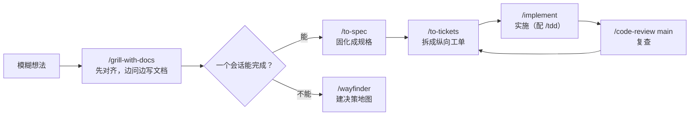

---
tags:
  - 主题
  - Agent
  - Skill
  - 教程
type: tutorial
created: 2026-08-05
---

# 技能库使用手册

> 目标：一个功能需求从想法到合并，按这套技能走一遍：**对齐 → 规格 → 拆单 → 实施 → 复查**，每一步有明确的发起方式、产出和验收标准。

## 一、先理解这套技能的分工

核心是 Matt Pocock 工程系列（opencode / Codex / Claude 会话中均可直接 `/` 调用）：



- **主链路技能**（显式调用，切阶段用）：grill-with-docs、to-spec、to-tickets、implement、code-review、wayfinder、handoff。
- **实施中嵌入**：tdd（测试先行）、diagnosing-bugs / systematic-debugging（修 Bug）。
- **自动辅助**：domain-modeling（维护 CONTEXT.md 术语）、codebase-design（模块设计词汇），写作和设计时自动生效。
- **不知道用哪个**：`/ask-matt <当前状态>` 会给你推荐下一步。

> 每个 agent 只加载自己目录下的技能：opencode 会话聚合 `.agents`、`.claude`、`.config/opencode`（25 个）；Codex 目录最全（多出逆向工程 4 件套）。技能列表在**启动时加载**，新装/补齐的技能需重启会话才可见。

## 二、首次使用：初始化仓库

工程系列需要项目级的 issue tracker 和文档布局，每个仓库**跑一次**：

```text
/setup-matt-pocock-skills
```

它会配置三件事：

1. **Issue tracker**：选**本地 Markdown**（规格与工单落在 `.scratch/<feature-slug>/issues/`，便于版本控制）；团队已有 GitHub/Linear 则对接现有平台。
2. **Triage 标签**：标识可交给 agent 的工单（`ready-for-agent`）。
3. **文档位置**：`CONTEXT.md`（统一术语）+ `docs/adr/`（架构决策记录）。

E:\AI_Novels 已初始化，约定见 `docs/agents/issue-tracker.md`。换仓库后要重新运行。

## 三、主流程：一个功能怎么走

### 1. `/grill-with-docs`：先把需求问清楚

**什么时候用**：需求模糊、有多个实现方向、涉及业务术语或难以回滚的决策。普通功能从这里开始。

```text
/grill-with-docs 为 AI_Novels 增加"角色设定卡"：用户能创建、复用并绑定到作品，生成时作为上下文。
```

**会发生什么**：

- 一次只问一个关键问题（不是一整份问卷），每个问题带推荐答案；
- 能从代码库/文档查证的事实会先自行查证；
- 已确定的术语立即写入 `CONTEXT.md`；难回滚的取舍记 ADR。

**何时结束**：目标、范围、术语、边界条件和关键取舍都已明确。**不要在 grilling 中催着编码**——这阶段的价值就是别做错方向。

### 2. `/to-spec`：把已讨论内容固化成规格

**什么时候用**：需求已谈清，但工作跨多个模块、多个会话或多人协作。在 grill 结束后**同一上下文**里调用，它不会重新采访你：

```text
/to-spec
```

**产出**：发布到 issue tracker 的规格文档（.scratch 下），含问题陈述、方案、用户故事清单、实现决策、测试决策、非目标。自动打上 `ready-for-agent`。

**要点**：

- 实现决策里**不写具体文件路径和代码片段**（容易过期）；
- 它会先和你确认测试 seam（从外部行为验证的切入点）是否合理。

### 3. `/to-tickets`：拆成能独立验证的工单

```text
/to-tickets <规格文件路径>
```

每张工单是一个 **tracer bullet（纵向切片）**：从数据、接口到 UI 和测试走通一条完整路径，而不是"先改数据库、再改接口、最后改 UI"的横向分层。

发布前会先展示每张工单的**标题、被谁阻塞、交付什么端到端行为**。此时重点检查：

- 粒度是否过大（一张工单应该一个会话能做完）；
- 依赖关系是否真实；
- 每张能否单独演示或验证。

### 4. `/implement`：一次实施一张工单

```text
/implement .scratch/role-cards/issues/01-create-role-card.md
```

推荐实践：

1. 每张工单用**相对干净的新会话**；
2. 先读工单和相关领域文档，再动代码；
3. 在合适的 seam 上执行 `/tdd`：先让行为测试失败，再实现，再重构；
4. 过程中持续跑类型检查与局部测试，结束时跑完整验证；
5. 完成后立即 `/code-review`。

> 提交、推送、部署是不可逆动作，按项目授权流程执行。

### 5. `/tdd`：测试先行

**什么时候用**：任何"行为"的开发（新功能、修 Bug），或你想先定义外部可见行为再实现。

```text
/tdd 为角色卡的分组排序编写行为测试
```

先看到测试红（失败），再实现让它变绿，最后重构。测试只测外部行为，不测实现细节。

### 6. `/code-review`：从两条轴复查

```text
/code-review main
```

`main` 是固定对比点，也可以传分支、tag、commit SHA 或 `HEAD~5`。以 `git diff main...HEAD` 为范围，**并行**跑两份检查：

- **Standards**：是否符合仓库编码规范，识别有判断空间的坏味道；
- **Spec**：是否满足原始规格，有没有漏项、实现错误或范围蔓延。

两份结果**分开读**：风格合格不代表需求做对了，反之亦然。

### 7. 修顽固 Bug：`/diagnosing-bugs`

**什么时候用**：难复现、间歇性或性能问题。**先这样说，别直接改**：

```text
/diagnosing-bugs 导出含图片的章节偶发失败，频率约 5%，复现步骤：……
```

核心是 **tight feedback loop**：先构造一个稳定触发并判定问题的命令/测试/脚本（先"红"），再提假设、加最少量观测、修复、补回归测试。没有可复现信号时不改代码。

> 顺手的小 Bug 也建议先 `/systematic-debugging`（系统化调试，先于任何修复）。

### 8. `/handoff`：把当前会话交给新会话

**什么时候用**：换线程、上下文接近上限、或拆出原型探索。

```text
/handoff 下一会话继续实现角色设定卡的第 2 张工单
```

它生成一份交接文档供**新会话**读取；文档保存在系统临时目录，**务必记下输出的绝对路径**。不要在需求澄清、规格、拆单的中间阶段切断上下文，否则产物会丢失决策依据。

## 四、按场景选择

| 场景 | 操作 | 示例 |
| --- | --- | --- |
| 不知道下一步怎么走 | `/ask-matt` | `/ask-matt 我有一份 PRD，接下来做什么？` |
| 新功能、规则不清楚 | `/grill-with-docs` | 见主流程第 1 步 |
| 讨论完要固化成规格 | `/to-spec` | 直接在 grill 后的上下文里调 |
| 规格拆成可实施工作 | `/to-tickets` | `/to-tickets <spec>` |
| 实施一张工单 | `/implement` | `/implement <ticket>` |
| 测试先行 | `/tdd` | `/tdd 为章节排序写行为测试` |
| 完成后复查 | `/code-review main` | 对比点可换分支/SHA |
| 难复现、间歇、性能问题 | `/diagnosing-bugs` | 附复现步骤和频率 |
| 会话要交给别人继续 | `/handoff` | 附下一会话目标 |
| 项目巨大、路径不明 | `/wayfinder` | `/wayfinder 规划多代理生成架构` |
| 架构变复杂、难改 | `/improve-codebase-architecture` | 出 HTML 报告，挑一个深化 |
| 领域术语含混 | `/domain-modeling` | "你说的'作品'到底是书还是文件夹？" |
| 设计模块接口/seam | `/codebase-design` | "用 codebase-design 设计素材库模块" |
| 落地页 / portfolio / 改版 | `/design-taste-frontend` | "做个不像模板的 SaaS 落地页" |
| 任何前端界面打磨/审计 | `/impeccable` | `/impeccable audit 主页对比度和动效` |
| UI 合规审查 | `/web-design-guidelines` | "review my UI，检查 src/components" |
| 写/优化 React 代码 | `/react-best-practices` | 自动参考（69 条 Vercel 规则） |
| docx 文档 | `/doc` | 交付前渲染成图逐页检查 |
| PDF 文档 | `/pdf` | reportlab 生成 + Poppler 渲染验证 |
| 真实浏览器操作 | `/playwright` | snapshot → 交互 → 截图 循环 |
| 收发邮件 | `/agently-mail` | 写操作两阶段确认，防注入 |
| 反编译 APK / 提取 API | `/android-reverse-engineering` | 仅 Codex 会话可用 |
| 找/装新技能 | `/find-skills` | 先查 skills.sh 排行榜再安装 |

## 五、几个容易混淆的选择

### `grill-with-docs` 与 `grilling`

- **`grill-with-docs`**：边拷问边把术语写进 CONTEXT.md、决策记 ADR。**默认选它**。
- **`grilling`**：纯拷问不写文档；适合只想快速压力测试一个想法的场合。

### `grill-with-docs` 与 `wayfinder`

- **`grill-with-docs`**：一个会话仍能谈清的需求，结果是清晰术语和决策。
- **`wayfinder`**：跨多个会话、现在拆不出工单的巨型未知工作，先建"决策地图"清除不确定性，再回到 `to-spec → to-tickets`。普通功能别用，它不是默认入口。

### `to-spec` 与 `to-tickets`

- **`to-spec`**：产出**一份**规格（PRD），回答"做什么、为什么"。
- **`to-tickets`**：把规格**拆成多张**可独立验证的工单，回答"先做哪个、谁依赖谁"。

### `diagnosing-bugs` 与"直接修"

顽固问题一律先 `/diagnosing-bugs` 建反馈环；小问题可先 `/systematic-debugging`。两者都不是"凭直觉改代码"。

### `design-taste-frontend` 与 `impeccable`

- **`design-taste-frontend`**：专攻 landing page / portfolio / 改版，反 LLM 模板化。
- **`impeccable`**：覆盖面更大（dashboard、表单、主题、动效），有子命令体系，适合深度打磨。落地页找前者，界面迭代找后者。

### `doc` 与 `pdf`

按目标格式选：`.docx` 用 `doc`，PDF 用 `pdf`。两者都要求**渲染后视觉检查**，不是导出就完事。

## 六、完整演练：新增"角色设定卡"

```text
1. /setup-matt-pocock-skills        （首次进入仓库时）
2. /grill-with-docs 增加角色设定卡：可创建、复用、绑定作品，生成时作为上下文
3. （逐题确认范围、权限、数据迁移、提示词注入方式、测试 seam）
4. /to-spec
5. /to-tickets <刚生成的规格>
6. （确认每张纵向工单与阻塞关系）
7. /implement <第一张无阻塞工单>
8. /tdd 为角色卡的创建与绑定写行为测试
9. /code-review main
10. /implement <下一张已解除阻塞的工单>
```

若第 3 步发现"角色卡内容能否提升生成质量"无法只靠讨论决定，用 `/handoff` 开新会话做个原型实验，带结论回到主流程再生成规格。

## 七、维护与更新

- **技能更新**：`npx skills check` / `npx skills update`；agently-mail 出现更新提示时按提示升级并**重启 agent** 生效。
- **补齐技能**：从 `.codex\skills` 复制缺失目录到目标生态的 `skills\` 下即可（同名同源，已验证内容一致）；opencode 会话新技能需重启可见。
- **找新技能**：`/find-skills` 先看 [skills.sh](https://skills.sh/) 排行榜（安装量 ≥ 1K、来源可信），再 `npx skills add <owner/repo@skill> -g -y`。

## 八、速查卡

```text
进新仓库       → /setup-matt-pocock-skills（每仓库一次）
新想法         → /grill-with-docs（一次一个问题，边问边写文档）
需求已谈清     → /to-spec（发布到 .scratch/<slug>/issues/）
规格要拆工单   → /to-tickets <spec>
做一张工单     → /implement <ticket>
测试先行       → /tdd
完成后复查     → /code-review main
顽固 Bug       → /diagnosing-bugs <现象与复现>（先建反馈环）
小 Bug         → /systematic-debugging
要换会话       → /handoff <下一会话目标>（记下临时文件路径）
项目太大       → /wayfinder（决策地图，只规划）
架构变复杂     → /improve-codebase-architecture
不知选哪个     → /ask-matt <当前状态>
落地页         → design-taste-frontend    界面打磨 → impeccable
UI 审查        → web-design-guidelines    React → react-best-practices
docx → doc    PDF → pdf    浏览器 → playwright    邮件 → agently-mail
逆向           → android-reverse-engineering（仅 Codex）
找技能         → /find-skills
```

## 相关笔记

- [[Agentic CLI 总览]]
- [[技能、插件与扩展机制]]
- [[Matt Pocock Skills 实战教程]]
- [[多代理协作]]
