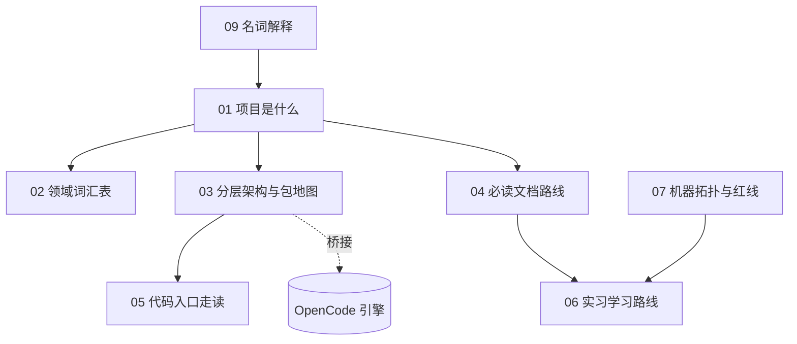

# 项目导航 MOC · AI_Novels_OpenCode

> [!abstract] 这是你（实习生）的 onboarding 中枢
> 本 vault 把 `F:\AI_Novels_OpenCode`（OpenCode fork → 网文 SaaS）的知识整理成互链笔记。**从 [[01 项目是什么]] 开始**，按 [[04 必读文档路线]] 推进，每天对照 [[06 实习学习路线]]。

> [!tip] 完全零基础？先读 [[09 名词解释]]
> 里面用大白话+比喻解释了 monorepo、OpenCode、fork、HEAD、SSE、wikilink 等所有黑话。其他笔记里的生词都链到了它。

## 知识地图（Mermaid）

## 笔记清单

### 核心概念
- [[09 名词解释]] — 🚨 零基础第一读：所有黑话的大白话词典
- [[01 项目是什么]] — 这项目到底是什么、设计铁律、分层
- [[02 领域词汇表]] — CONTEXT.md 的 ubiquitous language（写代码/文档/票据必须用）
- [[03 分层架构与包地图]] — 底座引擎 vs 领域层 vs 前端的包划分

### 怎么学 / 怎么干
- [[04 必读文档路线]] — 文档阅读顺序（含仓库内绝对路径）
- [[05 代码入口走读]] — 从哪个文件开始读源码
- [[06 实习学习路线]] — 5 天实习计划（带 checkbox）
- [[07 机器拓扑与红线]] — 开发机 vs 192.168.31.35，哪些事绝对不能做

### 实现深读系列（基于真实代码，逐行讲，带自测）
> [!abstract] 目标
> 让小白也能看懂项目**具体实现**。每篇聚焦一个模块，对照真实源码、解释每行在做什么、末尾给自测题。按编号顺序读。

- [[覆盖率清单]] — 📊 函数级总台账（311 符号 / 79 文件），逐函数勾选进度，全勾满 = 验收通过

- [[10 实现深读①：作品存储与唯一提交服务]] — ✅ 已写：作品目录骨架 / 出生(git init+commit) / 写·Keep·Undo 背后的 git 命令 / 唯一提交服务门面 / 索引同步
- [[11 实现深读②：六角色与目录限域]] — ✅ 已写：role.ts + role-permissions.ts 逐函数讲透，含权限如何落地 OpenCode PermissionV2
- [[12 实现深读③：Session 桥接]] — ✅ 已写：命令→SessionV2.prompt（gateway-run-bridge + adapter + delegation-flow + event-mapper 逐函数）
- [[13 实现深读④：SSE 事件映射与运行簿记]] — ✅ 已写：sse-frame + sse-hub + run-map + drain-admission + startup-reconciliation 逐函数
- [[14 实现深读⑤：Workbench HTTP API]] — 🔜 待写：workbench.ts 与各 routes 的边界
- [[15 实现深读⑥：检索索引]] — 🔜 待写：search/search-index 的写后可见/Undo 消失
- [[16 实现深读⑦：前端三栏与 projection]] — 🔜 待写：novel-web 的 *-projection.ts 怎么渲染 Agent 信息流

## 使用约定
- 所有 `[[wikilink]]` 都能在 Obsidian 里点击跳转；改文件名 Obsidian 会自动更新链接。
- 仓库路径用反引号代码块标注（如 `packages/novel-server/src/main.ts`），方便回 IDE 对照。
- 红线性内容（机器拓扑、并发不变量）用 `> [!warning]` / `> [!danger]` callout 标出。
- 想加自己的笔记，复制一篇的 frontmatter 模板即可，记得加 `tags: [onboarding]`。
