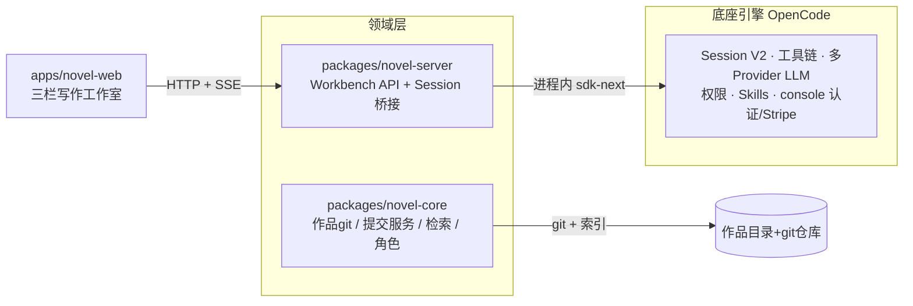

# 01 项目是什么

> [!tip] 术语看不懂？随时跳 [[09 名词解释]]（如 [[09 名词解释#monorepo]]、[[09 名词解释#OpenCode]]、[[09 名词解释#fork（复刻 / 分叉）]]）。

> [!info] 一句话
> 它是 **OpenCode**（开源 AI 编程 Agent）被 fork 后，在 monorepo 内重建为 **长篇网文（web-novel）创作 SaaS**。引擎/底座 = OpenCode；领域层 = `novel-core` + `novel-server`；前端 = `apps/novel-web`。

产品体验闭环：**作者说一句话 → AI 用工具读写作品文件 → 改动呈现为 git diff → 作者 Keep/Undo 裁决 → 六角色多 Agent 协作且可恢复。**

## 设计铁律（贯穿所有决策）

> [!danger] 铁律（来自 `CONTEXT.md`）
> **不规定行为路线 / 判断归模型 / 确定性归系统 / 作者即裁判。**
> 模型自己能做的，系统不做；系统只做模型做不到的确定性事。

## 分层（Mermaid）

## 三个关键心智模型
1. **作品 = 目录 + git 仓库**：HEAD=正式，工作区=未提交改动。
2. **六角色多 Agent**：主管(主编)+五专家，写权限按目录限域。
3. **零系统防剧透**：靠设定写法/提示词纪律/校对/作者 diff 裁判，不是权限过滤。

→ 继续读 [[02 领域词汇表]]（先掌握术语，否则看代码会懵）。
→ 架构与包划分见 [[03 分层架构与包地图]]。
