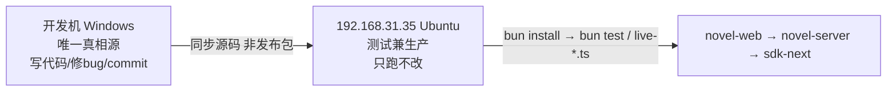

# 07 机器拓扑与红线

> [!danger] 红线（违反 = 事故）
> **代码只在开发机（本机 Windows）改。同步到 `192.168.31.35` 后只跑测试/验收，绝对禁止在那台机器 `vim` / 热补丁 / `git commit`。**

## 机器拓扑

| 角色 | 机器 | OS | 说明 |
|---|---|---|---|
| 开发机 | 本机 | Windows（当前） | **唯一代码真相源**；写代码 / 修 bug / commit |
| 测试 = 生产 | `192.168.31.35` | Ubuntu | 同步源码后验收；**禁止在机上改代码** |

## 流程
**开发机修 → 同步源码到 35 → 在 35 复测。** 禁止在 35 上编辑。

## 为什么
避免"两台机器都有改动、git 历史分叉、不知道哪份是真的"。所有修改的权威副本在本机 git。35 只是验收环境。

## 相关
- 细节见 `docs/novel/architecture-boundaries.md` §1.4
- 联调步骤见 `docs/novel/dev-frontend.md` 与 `docs/novel/accept-lane-a.md`
- 纳入 [[06 实习学习路线]] Day 4

> [!warning] 如果你必须在 35 上排查
> 只允许 `bun test` / 看日志 / 读代码。任何修改都回到开发机做，再重新同步。
