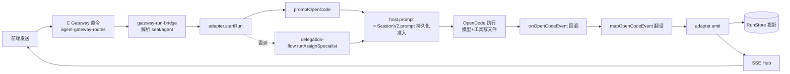

# 12 实现深读③：Session 桥接（命令 → SessionV2 → 事件 → SSE）

> [!abstract] 这篇讲什么
> 作者在前端点"发送"，后端收到命令后，怎么变成 OpenCode 的一次执行、再把 AI 干活的实时进度推回前端。这一层叫**桥接（bridge）**。全部基于真实源码：`runtime/opencode/adapter.ts`(928行)、`delegation-flow.ts`、`event-mapper.ts`、`gateway-run-bridge.ts`、`delegation-bridge.ts`。生词点 [[09 名词解释]]。

---

## 0. 人话问题

前端按钮 → 后端 API（`[[05 代码入口走读]]` 的 `workbench.ts`/`agent-gateway-routes.ts`）→ **本篇的桥接层** → OpenCode 引擎真正跑模型、调工具 → 结果再流回前端界面。

桥接层干三件事：
1. **命令落到正确的 Session**（哪个作品、哪个 Agent）。
2. **命令变成 `SessionV2.prompt`**（OpenCode 的执行入口）。
3. **把 OpenCode 的原生事件翻译成产品事件，推给前端**（SSE）。

---

## 1. 整体链路（Mermaid）



---

## 2. 命令怎么落到正确的 Session（gateway-run-bridge.ts）

> [!tip] 复习：[[09 名词解释#C 会话聚合]]、[[09 名词解释#六角色 / 主编 / 专家会话 / 委派]]。

### 2.1 `gatewayConversationForSeat`（gateway-run-bridge.ts:10）
- **做什么**：给一个 `work` 和一个 `sessionId`，算出对应的"产品会话 id"。
- **规则**：如果这个 session 是作品的主管（supervisor）会话 → 用 `conversationIdFor.work(work.id)`（主会话）；否则用 `conversationIdFor.seat(sessionId)`（专家座位会话）。
- **为什么**：一个作品有"主会话 + 各专家会话"多个投影，必须按 session 归属到正确的那个。

### 2.2 `resolveGatewayConversationAgent`（gateway-run-bridge.ts:16）
- **做什么**：校验"当前这个对话能不能用指定的 agent 跑"。
- **步骤**：从 `work.crew` 查当前 session 默认 agent → 用户指定的 agent 优先 → 用 `resolveOpenCodeSeat` 找到该 agent 对应的 seat session → **若该 seat 的 sessionId 与当前 runtimeSessionId 不一致，直接报错"请切换到对应的 Agent 对话"**。
- **关键点**：产品会话永久绑定一个 crew seat；**role 选择不能把一次 run 挪到另一个 transcript**（注释 gateway-run-bridge.ts:15）。这是"会话树"隔离的硬保证。

### 2.3 `prepareGatewayRunSeat`（gateway-run-bridge.ts:50）
- **做什么**：在真正 prompt 之前，确保目标 agent 的 OpenCode Session 已经"物化"（materialize）好——调 `seatMaterializer.ensure`（建 session、绑 agent、绑 owner/workRoot）。
- **为什么**：懒加载 seat，避免为没用到的 agent 预先建一堆 session。

### 2.4 `gatewaySessionDeleted`（gateway-run-bridge.ts:42）
- **做什么**：检查某个 runtime session 是否已被标记删除。命令入口据此拒绝向已删会话发命令。

---

## 3. 适配器主心骨（adapter.ts）

`createOpenCodeRuntimeAdapter`（adapter.ts:78）是**工厂函数**，返回一个对象，里面是桥接层所有对外能力。它装配了：`sse`(SSE Hub)、`runMap`(run↔prompt 映射)、`drainAdmission`(并发 drain 准入)、`delegationFlow`、`startupReconciliation`。

下面按"在链路里出现的顺序"逐个讲内部关键函数。

### 3.1 `emit`（adapter.ts:131）—— 事件的唯一出口
```ts
const event: ProductEvent = { epoch, conversationId, runId, seq, ...template }
store.apply(event); const feed = store.feedEvent(event)
for (handler of subscribers) handler(event)
sse.publish(event, { beganAt })
```
- **做什么**：每一条要发给前端的"产品事件"都必须经过它。它负责：① 盖信封（epoch/会话/run/序号 seq）；② 写入 `RunStore`（投影）；③ 通知内存订阅者；④ 推到 SSE Hub。
- **为什么统一出口**：保证"事件顺序(seq)、持久化、实时推送"三件事永远一起发生，不会漏。

### 3.2 `activeRun`（adapter.ts:152）
- **做什么**：给定一个会话，找出"当前最该承接新指令的 run"——优先 running/waiting_approval 的；否则按队列位置(ququePosition)取最早排队的。
- **服务链路**：`startRun` 的 steer 分支要用它判断"有没有正在跑的 run 可以塞方向调整"。

### 3.3 `observeRunEvents`（adapter.ts:186）—— 原生事件 → 产品事件的转换器
这是事件回流的核心。它返回一个对象，核心是一个回调 `onOpenCodeEvent(event)`：
1. `store.noteOpenCodeSeq(...)` 记录事件序号（用于重连 replay 的游标）。
2. 用 `runMap` 把事件归到正确的 run（promptedRun / activeRunId）。
3. **`for (const template of mapOpenCodeEvent(event))`** —— 把原生事件翻译成产品事件模板。
4. 特判：作者自己的消息回填真实文本/上下文/checkpoint（避免被 AI 富化后的 prompt 覆盖）；`run.failed` 时调用 `finish` 收尾。
5. 调 `emit(...)` 发出去。
6. `maybeAutoReplyPermission(...)` —— 放权档下自动回复权限请求（见 3.10）。
- **`onIdle`**：原生会话空闲 → 标记 run 完成、清理 active run、触发 `onTerminal`。
- **`onTerminalFailure`**：原生执行报错 → 标记 run 失败。

### 3.4 `promptOpenCode`（adapter.ts:292）—— 调 OpenCode 执行
- **做什么**：组装 `prompt` 对象（`sessionID`/`messageID`/`text`/`files`/`delivery`），然后 `await host.prompt(...)`。
- `host.prompt` 就是 **`SessionV2.prompt`**（OpenCode 的执行入口，带持久化准入）。
- **关键分支**：
  - `admitOnly`：只把输入放进原生 inbox，**不**再挂一个全局 drain 观察者（用于在主会话已有时只补一条 admission）。
  - `schedule` + `drainAdmission`：排队唤醒（并发 drain 上限）。
  - 普通：直接带上 `observer.callbacks` 启动实时观察。
- 若 `result.admitted`：发 `message.completed`(user_message) 事件；delivery 为 `queue` 时同步原生队列顺序。
- **这是"命令 → SessionV2.prompt"这句话的真正落点。**

### 3.5 `startRun`（adapter.ts:549）—— 最常被调用的入口
- **幂等**：若 `runId` 已存在且文本一致 → 直接返回旧 run（**幂等冲突检测**，防止重发）。
- **steer 分支**（有活跃 run 且 delivery=steer）：`waitForRunAdmitted` 等 run 进入可执行态 → `promptOpenCode` 以 `delivery:"steer"` 追加方向（**不新开 run**）。
- **新建分支**：无活跃 run → 解析目标 session（`seatMaterializer.ensure` 懒建 seat，默认 agent=主编）→ `store.createRun` 写入一条 `queued` run → 捕获工作区 checkpoint（`captureWorkspaceCheckpoint`）→ `promptOpenCode` 投递。
- **业务含义**：对应 spec 的"排队(Queue)默认投递 / 调整方向(Steer)显式投递"两种模式。

### 3.6 `cancelActiveRun` / `cancelRun`（adapter.ts:681 / 818）
- **做什么**：打断正在跑的 run。
- **逻辑**：若在原生 wake 前就取消（队列中）→ `cancelQueuedNativePrompt`（直接撤掉未执行的 prompt）；否则对每个 runtime session 调 `host.interrupt`（OpenCode 中断）→ 发 `run.cancelled`。
- **对应 spec**：`interrupt → SessionV2.interrupt`。

### 3.7 `resubmit`（adapter.ts:718）—— 从历史消息重提
- **做什么**：作者点"重发这条"时，截断该 item 之后的历史、可选还原工作区 checkpoint、新建 run 重新投递。
- **关键**：`store.truncateFromItem` 截断投影 + `restoreWorkspaceCheckpoint` 还原磁盘 → 真正做到"回到那一刻重来"。

### 3.8 `updateQueuedRun` / `reorderQueuedRun`（adapter.ts:837 / 871）
- **做什么**：改排队中 run 的文本 / 调换顺序。
- `amendedNativePrompt`（adapter.ts:405）：因为原生 prompt 可能带了 skills 前缀，改写时只替换"作者文本"那段、保留前缀，避免破坏结构。

### 3.9 `resolveApprovalByRequest`（adapter.ts:896）
- **做什么**：审批 UI 的回复入口。permission → `host.replyPermission`(once/reject)；question → `host.replyQuestion`(选项)。

### 3.10 `maybeAutoReplyPermission`（adapter.ts:51）/ `applyComposerPrefsToStore`（adapter.ts:37）
- **做什么**：实现"放权档"——`permissionLevel` 决定某些工具自动放行/拒绝，不用每次问作者（对应 [[02 领域词汇表]] 的"放权"概念）。

### 3.11 `ensureConversation` / `rebuildProjection`（adapter.ts:451 / 490）
- `ensureConversation`：作品/座位首次出现时建产品会话记录（conversationId 由 work/seat 恒定派生，重启不变）。
- `rebuildProjection`：投影为空时，从 OpenCode 原生 `sessionContext` 重建历史 item（F5/重启后旧作品仍可回看）。

### 3.12 `projectNativeQueueOrder` / `syncNativeQueueOrder`（adapter.ts:386 / 402）
- **做什么**：把 OpenCode 原生的队列顺序投影成 C 读视图（发 `run.queued` 带 position）。**不维护第二套队列**——只读原生真相。

---

## 4. 事件翻译表（event-mapper.ts）—— 整篇的"字典"

`mapOpenCodeEvent`（event-mapper.ts:16）是一个**纯函数** `switch`：OpenCode 事件类型 → 产品事件数组。举几个最关键的：

| OpenCode 原生事件 | 翻译成的产品事件 | 含义 |
|---|---|---|
| `session.next.prompt.admitted` | `message.completed`(user_message) | 作者输入被接纳 |
| `session.next.prompted` | `run.started` | run 被提升执行 |
| `session.next.text.delta` | `message.delta` | 流式文字片段 |
| `session.next.text.ended` | `message.completed`(assistant) | 一段回答写完 |
| `session.next.tool.called/.success/.failed` | `tool.started/.completed/.failed` | 工具调用 |
| `permission.v2.asked` | `approval.requested`(permission) | 请求授权 |
| `question.v2.asked` | `approval.requested`(question) | 提问作者 |

- **`itemId` 一律由 OpenCode 自己的稳定 ID 派生**（`itemIdFor("text", textID)` 等）——保证 `message.delta` 的流式预览，最终能被 `message.completed` 按 id 原地替换，前端不会看到重复气泡。
- `STATUS_FROM_EVENT`（event-mapper.ts:125）：**run 的状态只能由事件派生**（running/waiting_approval/completed/failed…）。这是状态机的唯一来源，杜绝"代码里随便改状态"。

---

## 5. 委派：主编 → 专家（delegation-flow.ts + delegation-bridge.ts）

### 5.1 类型：`DelegationHandle` / `createDelegationId`（delegation-bridge.ts:3 / 10）
- `DelegationHandle`：一次委派的句柄——`delegationId`、父会话、角色、专家 session。
- `createDelegationId`：生成 `sub_xxx` 形式 id。

### 5.2 `runAssignSpecialist`（delegation-flow.ts:28）—— 主编派活给专家
1. 算出 supervisor 会话 id（主会话）和 specialist 会话 id（专家座位）。
2. 确保两边产品会话记录存在；`seatMaterializer.ensure` 物化专家 session 并绑 `agent = role`（设定/正文…）。
3. supervisor 侧建一个 run（若没有活跃 run）；specialist 侧建一个 `queued` run，并 `attachRuntimeRef` 把两边 run 关联起来。
4. **发 `delegation.issued` 事件**到主会话（摘要，含角色/summary）。
5. `host.prompt` 让专家 session 真正干活；`onOpenCodeEvent` 里：专家事件 `emit` 到**专家会话**，同时用 `createDelegationActivityAuthor` 生成"安全摘要" `emit` 到**主会话**。
6. 专家跑完 → 发 `delegation.returned`（completed/failed）到主会话。

> [!note] 关键设计
> **完整事件只落专家会话；主会话只接收安全的 delegation activity 摘要**（delegation-flow.ts:13 注释）。作者在主会话看到的是"主编委派了设定专家，专家回来了"，而不是专家内部的每一步 tool 调用。这正是 [[02 领域词汇表]] 的"委派摘要"——不复制专家原始 transcript。

---

## 6. 自测（答上来 = 真懂这条链路）

1. 作者点"发送"，从 `agent-gateway-routes` 到真正调 OpenCode 执行，中间经过哪几个桥接函数？（提示：gateway-run-bridge → adapter.startRun → promptOpenCode → host.prompt）
2. `emit` 为什么被称为"事件的唯一出口"？它做了哪 4 件事？
3. `startRun` 里 delivery=`steer` 和默认 `queue` 的行为差异是什么？分别对应 spec 里哪两个概念？
4. `mapOpenCodeEvent` 是纯函数，它输出里的 `itemId` 为什么要用 OpenCode 的稳定 ID 派生？
5. run 的状态（running/completed/failed）从哪里来？能不能在别的代码里直接 `run.status = "completed"`？
6. 主编委派"设定专家"后，主会话里作者看到的是专家的全部 tool 调用，还是一段摘要？为什么这样设计？

> 下一篇 [[13 实现深读④：SSE 事件映射]]：专门拆 `sse-hub.ts` / `sse-frame.ts` / `run-map.ts` / `startup-reconciliation.ts` / `drain-admission.ts` —— 事件怎么变成前端能收的 SSE 帧、断线怎么 replay、并发 drain 怎么限流。
