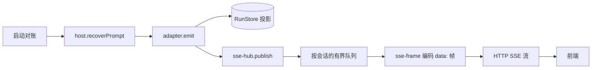

# 13 实现深读④：SSE 事件映射与运行簿记

> [!abstract] 这篇讲什么
> ③ 里 `emit` 把产品事件写进 `RunStore` 又推给 SSE Hub，事件就算"出发"了。本篇拆事件到达前端前的最后一程：① 帧怎么编码（sse-frame）、② 怎么 fan-out 给多个浏览器并防慢消费者（sse-hub）、③ `run↔原生 prompt↔session` 的簿记（run-map）、④ 并发 drain 限流（drain-admission）、⑤ 进程重启后怎么对账（startup-reconciliation）。生词见 [[09 名词解释]]。

---

## 1. 链路回顾（③ 的 `emit` 之后）

---

## 2. 帧编码底层（sse-frame.ts）

### 2.1 `createSseFrameStream`（sse-frame.ts:15）
- **做什么**：返回一个 `ReadableStream<Uint8Array>`，即浏览器能直接 `EventSource` 消费的 SSE 字节流。两个适配器（C Gateway 的 sse-hub、workbench-events）共用它。
- **`send(payload)`**：`encoder.encode('data: ' + JSON.stringify(payload) + '\n\n')` 入队（sse-frame.ts:67）。标准 SSE 帧格式：`data: <json>\n\n`。
- **背压/慢消费者熔断**：`write` 里若 `controller.desiredSize <= 0`（对端收太慢、缓冲区满）→ 记 `novel_sse_slow_consumer` 告警、cleanup、关流（sse-frame.ts:48）。客户端靠**重连拿快照**恢复，不背压服务端。
- **心跳**：每 `heartbeatMs`（默认 5s）发 `: ping\n\n` 注释帧，保活代理连接（sse-frame.ts:81）。
- **取消/断开**：`cancel()` 与 `AbortSignal` 都触发 cleanup，且 `write` 在 controller 已关闭时直接返回 false，异常不回灌发布循环。

> [!tip] 复习：[[09 名词解释#SSE / 服务端推送]]。SSE 就是一条 HTTP 长连接，服务端不断推 `data:` 文本帧。

---

## 3. SSE 传输接缝（sse-hub.ts）

### 3.1 `createSseHub`（sse-hub.ts:28）
- **做什么**：订阅登记 + 按**会话** fan-out + 慢消费者熔断 + 连接即快照。只管传输，不生产事件。
- **`publish(event, {beganAt})`**（sse-hub.ts:38）：
  - 取该 `conversationId` 的订阅者；无订阅直接 return（省 CPU）。
  - 进该会话的有界队列（`SSE_QUEUE_LIMIT=128`）；**队满则熔断**：清队列、删会话所有订阅者、`consumer.close()`，日志 `novel_sse_queue_overflow`（sse-hub.ts:44）。客户端重连拿快照。
  - 否则 `queueMicrotask` 批投递：把队列里事件逐个 `consumer.deliver` → `handle.send` → 帧编码（sse-hub.ts:55）。`onDelivery` 回调统计投递延迟。
- **`stream(conversationId, signal)`**（sse-hub.ts:73）：返回一个 `ReadableStream`（底层用 2.1 的 `createSseFrameStream`）。**连接建立时立刻发 `snapshot` 帧**——把当前 `RunStore` 投影快照推过去（sse-hub.ts:80），这是前端"断线/首屏对账"的基础。再注册 `consumer`（deliver=handle.send，close=handle.close）。

> [!note] 两道熔断
> ① **队列溢出**（128 条积压）→ 关该会话所有流；② **字节缓冲背压**（desiredSize≤0）→ 关单条流。都靠前端重连 + snapshot 自愈。

---

## 4. 运行簿记（run-map.ts）

### 4.1 `createRunMap`（run-map.ts:10）
- **做什么**：`run ↔ 原生 prompt message ↔ session` 映射的**唯一家**。
- **为什么需要**：OpenCode 一个 Session 的 drain 是串行的，但一个产品会话可以有多个已准入的排队输入；原生事件只带 `messageID`，要把它指回产品 `runId` 必须靠这张表。
- 关键 API：
  - `runForPrompt(conversationId, sessionId, messageId)`：messageID → runId（先查内存，miss 再查 `store.runForPromptMessage` 并回填缓存，run-map.ts:18）。
  - `rememberPromptRun` / `forgetPromptRuns`：记/忘映射（resubmit 截断后用 `forgetPromptMessages` 清掉被移除消息，run-map.ts:36）。
  - `activeRunIdOfSession` / `setActiveRunOfSession` / `clearActiveRunOfSession`：跟踪"某 session 当前正在跑的 run"。
- **分隔键**用 `\u0000`（null 字符）拼 `sessionId\u0000messageId`，避免 id 撞名。

---

## 5. 并发 Drain 准入（drain-admission.ts）

### 5.1 `createDrainAdmission`（drain-admission.ts:5）
> [!tip] 复习：[[09 名词解释#Durable 准入 / wake / drain]]。原生 inbox 是"队列真相"；本结构只决定"已准入的输入何时醒"。

- **做什么**：进程内的并发闸门，限制同时跑的 drain 数量（`maxConcurrentDrains`，非正整数直接抛 `RangeError`）。
- **数据结构**：`entries`(全部)、`waiting`(等待队列)、`active`(正在跑的 set)。
- `enqueue(entry)`：入队并 `pump()`；已存在返回 false（幂等，drain-admission.ts:48）。
- `pump()`：只要 `active.size < maxConcurrentDrains` 且 `waiting` 非空，就 `start(entry)`（drain-admission.ts:39）。
- `start`：加入 active → `entry.start()`；失败则 `onFailure` + `release`。
- `release(id)`：移除 entry、离开 active、调 `pump()` 补位（drain-admission.ts:20）。
- `cancel(id)`：未激活的才能撤（返回 `"queued"`），正在跑的返回 `"active"`（不能中途杀，drain-admission.ts:56）。
- **效果**：多个作品/多个 run 并发时，只有 `maxConcurrentDrains` 个真正在调模型，其余排队——保护本机算力。

---

## 6. 启动对账（startup-reconciliation.ts）

### 6.1 `createStartupReconciliation` / `reconcile`（startup-reconciliation.ts:22 / 45）
- **做什么**：进程重启后，把 `RunStore` 里还"活着"的 run 与 OpenCode 原生 inbox 对齐。返回 `{ resumed, interrupted }` 计数。
- **核心规则（注释 startup-reconciliation.ts:75）**：**原生 inbox 是重启后的顺序权威，绝不用 RunStore 插入顺序当恢复依据**——因为进程死前可能原生已重排。
- **流程**：
  1. 遍历 `store.activeRuns()`；只处理 `status==="queued"` 且有真实 `sessionId`+`messageId` 的，否则直接 `interrupt`（发 `run.interrupted` 事件，提示作者重发）。
  2. 按 session 分组；调 `host.queuedPrompts` 拿**原生队列顺序**，按 `messageId` 的位置重排 candidates（startup-reconciliation.ts:82）。
  3. 对根（位置最先的）run 建 `observeRunEvents` 观察者；用 `host.recoverPrompt` 恢复：
     - **无 drainAdmission**：直接 `recoverPrompt(resume: 默认)` → 返回 `"resumed"` 即恢复；否则 interrupt。
     - **有 drainAdmission**：先 `recoverPrompt(resume:false)` 只准入（admitted），再 `drainAdmission.enqueue` 真正唤醒（至多 `maxConcurrentDrains` 个并发）。
  4. 把映射记回 `runMap.rememberPromptRun`，并发 `projectNativeQueueOrder` 投影队列顺序。
- **业务含义**：服务崩溃重启，作者不需要手动重发；排队中的指令会被重新唤醒并继续，且严格按原生队列顺序（不是随机）。

---

## 7. 自测

1. 一条产品事件从 `emit` 到浏览器，经过了 sse-hub 的哪两个结构？（提示：按会话的有界队列 + 帧编码）
2. `sse-frame.ts` 里 `write` 发现 `controller.desiredSize <= 0` 会怎样？前端怎么自愈？
3. `run-map` 的 `runForPrompt` 查 miss 时 fallback 到哪？（提示：`store.runForPromptMessage`）
4. `drain-admission` 里 `maxConcurrentDrains` 控制的是什么？`cancel` 一个正在跑的 drain 会返回什么？
5. 启动对账为什么"绝不用 RunStore 插入顺序当恢复依据"？它信谁的排序？
6. 进程重启后，作者原本排队未跑的指令会丢吗？`reconcile` 怎么处理它们？

> 下一篇 [[14 实现深读⑤：Workbench HTTP API]]：拆 `workbench.ts` 与 `*-routes.ts`——C Gateway 命令总线怎么进来、`startRun`/审批/查询各路由如何落到 adapter。
