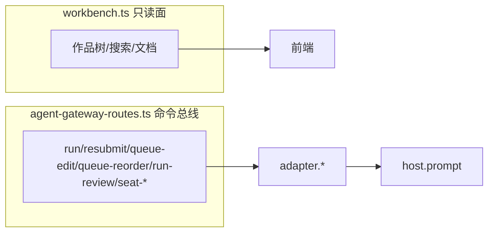

# 14 实现深读⑤：Workbench HTTP API 与命令总线

> [!abstract] 这篇讲什么
> ③ 里 `adapter.startRun` 等能力，是**命令总线**调起来的。本篇拆两类 HTTP 面：① `workbench.ts`——前端读作品目录树/打开文档/保存草稿的**只读+文件投影**（不碰 AI）；② `agent-gateway-routes.ts`——**命令总线**：作者"发送/重发/改排队/审批/打断"等指令如何进来、走幂等、落到 adapter。生词见 [[09 名词解释]]。

---

## 1. 两类 HTTP 面（Mermaid）

> [!tip] 复习：[[09 名词解释#幂等性 / 确定性]]、[[09 名词解释#C 会话聚合]]。

---

## 2. 作品树与文档投影（workbench.ts）

### 2.1 `buildBootstrap`（workbench.ts:149）
- **做什么**：首页/打开作品时返回"引导快照"——branch 信息（`MAIN_BRANCH_ID=正式内容`）、`authoritySnapshotVersion`（git HEAD 版本号）、`durableEventHighWater`（断线续传游标）。
- **为什么**：前端首屏要靠它知道"当前看哪个分支、作品树根在哪"。

### 2.2 `buildTree`（workbench.ts:179）
- **做什么**：一次性返回整个作品目录树（nodes + roots）。
- **实现**：`walkPaths(workRoot)` 递归列出所有文件（跳过 `.git`/`AGENTS.md`/`.gitkeep`）→ `treeChildrenMap` 建父子关系 → `buildTreeNode` 把每个路径转成树节点（带 `kind`/`revision`/`scaffold` 详情）。`Promise.all` 并行算每个节点的 git 版本号（revision）。
- **`buildTreeNode`**（workbench.ts:109）：单个节点的构造器；`scaffoldDetail` 把"正文/大纲/设定/人物…"映射成角色骨架（`scaffold:manuscript` 等），供前端高亮"这是设定目录"。

### 2.3 `buildTreeChildren`（workbench.ts:205）
- **做什么**：**分页**返回某个目录的子节点（每页 100，游标 `cursor`）。
- **为什么分页**：作品可能很大（设定/正文上千文件），不能每次全量拉。只 stat 这一层 + 必要的子目录，绝不 `walkPaths` 整仓（注释 workbench.ts:217）。

### 2.4 `searchTree`（workbench.ts:301）
- **做什么**：目录标题/路径搜索。匹配 label 或路径（含 NFC 归一化、长度 2–128 校验）。
- **关键**：返回命中项**及其祖先**（祖先闭包，前端树要展开路径）；分页前按路径全序稳定化（注释 workbench.ts:324：两次请求各走文件系统，枚举顺序不保证一致，必须先排序再分页）。

### 2.5 `locateTreeObject`（workbench.ts:370）
- **做什么**：给定 objectId，只返回它 + 祖先节点（精确定位一个文件的路径），不拉整棵树。

### 2.6 `ensureTreeScaffold`（workbench.ts:449）
- **做什么**：确保作品顶层目录骨架存在（`WorkLayout.TOP_LEVEL_DIRS`，即 ① 讲的 大纲/正文/设定…）；缺失则 `mkdir` + `.gitkeep`。
- **这是"作品出生"后第一次访问时补齐目录骨架**的地方。

### 2.7 `buildEditorDocument`（workbench.ts:477）
- **做什么**：打开一个 `.md` 文档时返回编辑器需要的完整数据（内容、版本、标题、treeNode、assetView）。
- **实现**：并行取 `latestFileCommit`（该文件最新 commit SHA）与文件内容（`readWorkFile` 或历史版本 `readAtCommit`）。`selectedVersionId` 非空则读历史版本（只读，readOnlyReason=historical-version）。`revision = workspaceRevision(content)`（内容指纹做 CAS 令牌）。
- **关键**：内容来源优先级 `input.content`(作者刚写的草稿) → 历史版本 → 工作区文件。

### 2.8 `restoreEditorHead`（workbench.ts:566）
- **做什么**：把某 commit 的文件内容写回工作区（"回滚到此版本"，不 Keep、不整仓 revert）。底层 `readAtCommit` + `writeEditorWorkspace`。

### 2.9 `writeEditorWorkspace`（workbench.ts:578）
- **做什么**：作者保存草稿。把 `assetDocument`(前端富文本) 用 `nativeMarkdown` 转成 markdown，再 `WorkGit.writeWorkspaceFile` 写到磁盘——**与 AI 改的是同一份文件**（HTTP 路径叫 `/draft` 只是兼容壳，注释 workbench.ts:577）。

### 2.10 `resolveScope` / `assertBranch`（workbench.ts:591 / 597）
- **做什么**：从 query 解析 `work_id`/`branch_id`（默认主分支）；`assertBranch` 校验只主分支可写（SaaS 当前只有"正式内容"一个分支）。

### 2.11 `TreePageError`（workbench.ts:140）
- **做什么**：树相关 HTTP 错误（带 status 码），如"父节点不存在"(422)。

---

## 3. 命令总线（agent-gateway-routes.ts）

### 3.1 `idempotentGatewayCommand`（agent-gateway-routes.ts:34）—— 幂等骨架
- **做什么**：所有写命令的通用包装。解析幂等键（`parseIdempotencyKey`）→ 拼 `commandScope(tenant+user+operation+resource+key)` → `respondIdempotentCommand` 查/存回执。
- **`operation` 枚举就是 spec 的"命令总线 8 action"**：
  `run` / `resubmit` / `queue-edit` / `queue-reorder` / `run-review` / `seat-delete` / `seat-renew` / `seat-restore`。
- **为什么**：同一指令因网络重试发两次，靠幂等键返回同一回执，绝不重复执行。

### 3.2 `mountAgentGatewayRoutes`（agent-gateway-routes.ts:70）—— 路由表
下面逐个路由（都是命令或快照，实时走 `/events` SSE）：

- **GET `/agent/works/:workId/seats`**：列作品岗位（六角色会话）。
- **DELETE `.../seats/:sessionId`**：删会话（operation=`seat-delete`，幂等）。
- **POST `.../seats/:sessionId/renew`**：换本（重建该角色 session，operation=`seat-renew`）。
- **POST `.../seats/:sessionId/restore`**：恢复已删会话（operation=`seat-restore`）。
- **GET `/agent/works/:workId/conversation`**：拿到 conversationId；必要时 `adapter.rebuildProjection` 从原生 context 重建（agent-gateway-routes.ts:185）。
- **GET `/agent/conversations/:id/snapshot`**：返回该会话的 RunStore 投影快照（前端首屏/重连对账）。
- **GET `/agent/conversations/:id/skills`**：列出可用 skills。
- **POST `/agent/conversations/:id/runs`**：**核心——作者发送新指令**（operation=`run`）。流程（agent-gateway-routes.ts:210）：
  1. 校验文本非空、模型/推理参数不允许在此指定（属账户级，返回 422 `model-route-is-account-scoped`）。
  2. `agentSubscriptionRejection` 查订阅是否拦截。
  3. `resolveRunAgent` + `resolveGatewayConversationAgent` 解析并校验 agent 是否绑对该会话（否则 422）。
  4. `parseComposerAttachments` / `parseRunContext` 解析附件与上下文。
  5. `prepareGatewayRunSeat` 懒建 seat → `adapter.applyComposerPrefs` 应用放权档 → **`adapter.startRun`**（③ 讲的核心入口）→ 返回 `runId`，202 已受理。
  6. 失败分支：`no-active-run`(409 steer 无活跃 run)、`idempotency-conflict`(409 确定性冲突)。
- **POST `/agent/conversations/:id/resubmit`**：从历史消息重发（operation=`resubmit`）→ `adapter.resubmit`（③）。支持 `revertWorkspace` 回滚磁盘。
- **POST `/agent/conversations/:id/goal`**：设/清会话目标（存 `store.setGoal`，带 `expectedRevision` 乐观锁防并发覆盖）。
- **POST `/agent/runs/:id/cancel`**：打断运行 → `adapter.cancelRun`（③）。
- **PATCH `/agent/runs/:id/input`**：改排队中 run 文本（operation=`queue-edit`）→ `adapter.updateQueuedRun`；返回 started/cancelled/not-queued 等细分错误。
- **POST `/agent/runs/:id/queue-position`**：调排队顺序（operation=`queue-reorder`）→ `adapter.reorderQueuedRun`。
- **GET `/agent/runs/:id/review`**：取运行结束后的工作区改动预览（`buildRunWorkspaceReview` + checkpoint）。
- **POST `/agent/runs/:id/review/approvals`**：接受/拒绝某文件某 hunk（operation=`run-review`）→ `resolveRunReviewAction`；成功后 `workbenchEvents.publish({kind:"workspace-changed"})` 通知前端刷新。
- **POST `/agent/approvals/:id`**：审批 UI 回复（permission/question）→ `adapter.resolveApprovalByRequest`（③）。
- **GET `/agent/conversations/:id/events`**：**SSE 实时流**——`adapter.sseStream(conversationId, signal)` 返回 `text/event-stream`（③/④ 讲的帧流）。

> [!note] 权限守门
> 每个写路由都先 `ownedConversation`（校验作品归属 `workVisibleTo` + 会话未删 `gatewaySessionDeleted`）；不归属直接 404。这是"作者即裁判 / 确定性归系统"的 HTTP 边界。

---

## 4. 自测

1. 作者在前端点"保存草稿"，最后写到磁盘的函数是哪个？它和 AI 写文件用的是不是同一份磁盘？（提示：`writeEditorWorkspace` → `WorkGit.writeWorkspaceFile`）
2. `buildTree` 和 `buildTreeChildren` 的差别是什么？为什么要分页？
3. 命令总线的 `operation` 枚举有哪 8 个？它们对应 spec 里说的什么？（提示：命令总线 8 action）
4. `POST .../runs` 里如果把 `model` 字段传上来，会怎样？为什么模型不让在作品级指定？
5. `idempotentGatewayCommand` 靠什么防止"重试导致重复执行"？
6. 前端拿实时进度走哪个路由？它底层返回的是 ③/④ 里哪个流？

> 下一篇 [[15 实现深读⑥：检索索引]]：拆 `search/search-index` —— 写后立即可见、Undo 立刻消失的检索语义如何实现。
