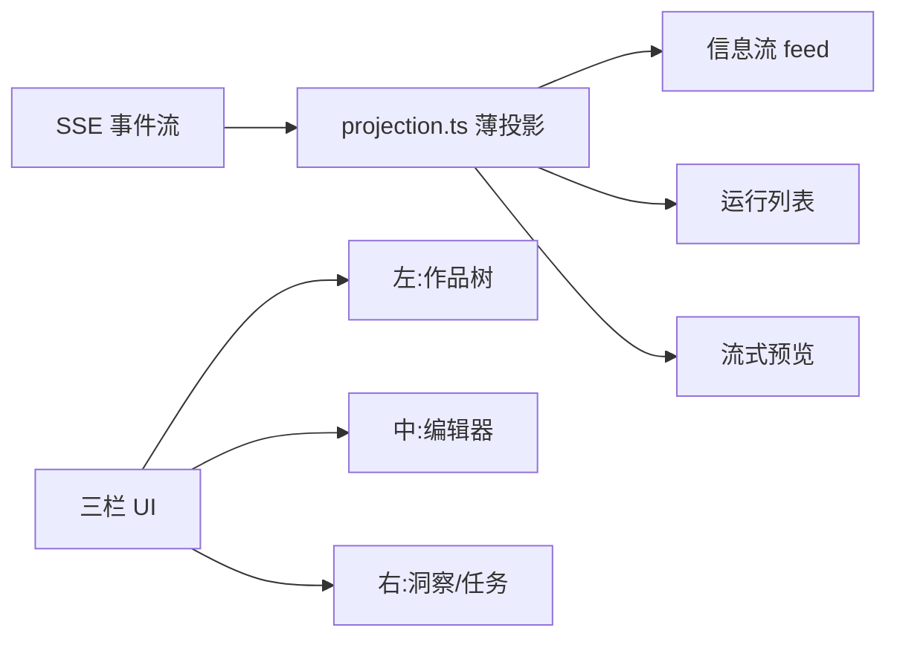

# 16 实现深读⑦：前端三栏与 projection

> [!abstract] 这篇讲什么
> 后端 ②/③/④ 把产品事件通过 SSE 推到前端。前端怎么把这些事件变成作者看到的"Agent 信息流"？答案在 `features/agent-chat/projection.ts`——一个**极薄投影**，只有 3 条规则。再补 `three-pane-linkage-projection.ts` 解释"左栏树 / 中栏编辑器 / 右栏洞察"三栏联动。生词见 [[09 名词解释]]。

---

## 1. 三栏长啥样（Mermaid）

---

## 2. 薄投影核心（features/agent-chat/projection.ts）

> [!note] 三条铁律（projection.ts:9 注释）
> 1. **delta 追加预览**（允许丢帧）；
> 2. **completed 按 itemId 整体替换为权威内容**；
> 3. **epoch 变化后的旧帧一律忽略**，由快照整体接管。
> 没有游标、没有序号比较、没有"sseAhead"启发式——极简才不会出乱序 bug。

### 2.1 状态形状 `AgentChatState`（projection.ts:17）
- 只持有：`conversationId`/`epoch`/`feed`(信息流)/`preview`(流式预览)/`runs`/`todos`/`goal`/`permissionLevel`/`pendingApproval`/`conversationState`。
- **`feed` 是唯一的 transcript**（projection.ts:21 注释）——前端只渲染 C Gateway 同源的这一个 feed，不自己造第二份。

### 2.2 `createAgentChatState` / `stateForConversation`（projection.ts:89 / 103）
- `createAgentChatState`：空状态出厂值（默认 `permissionLevel:"ask-risky"`）。
- `stateForConversation`：**身份护栏**——`conversationId` 变了就重置整个状态（projection.ts:106）。防止"切到另一个 Agent 会话时，旧会话的投影还残留在界面上"。

### 2.3 `applyGatewaySnapshot`（projection.ts:140）
- **做什么**：连接/重连时，用后端快照整体覆盖状态（feed 按 `sortKey` 排序）。对应 ④ 的 `snapshot` 帧——断线恢复就靠它。

### 2.4 `reduceGatewayEvent`（projection.ts:153）—— 事件归约器（核心）
- 每个 SSE 事件进来，返回新状态。关键分支：
  - **epoch 不一致直接丢弃**（projection.ts:155）：旧服务器进程推来的帧不算数，等快照接管。
  - `message.delta`：`preview` 按 `itemId` 追加文本（projection.ts:166）——这就是打字机效果的预览，允许丢（铁律①）。
  - `message.completed`/`reasoning.completed`/`tool.*`/`approval.*`：**走 `withFeed` 经 `upsertFeedEvent` 写入 feed**（projection.ts:157）。completed 会清掉对应 `preview`（铁律②：预览被权威内容替换）。
  - `delegation.issued`/`delegation.returned`：直接进 feed——对应 ③ 讲的"主会话只收委派摘要"。
  - 默认分支（run 状态帧）：`upsertRun` 更新 run 状态；**终态吸收规则**——一旦 run 已终态，后续任何帧（含迟到的 running）一律忽略（projection.ts:207），与 ④ `STATUS_FROM_EVENT` 同一逻辑。

### 2.5 `upsertFeedEvent` / `upsertRun`（projection.ts:124 / 132）
- **做什么**：feed/run 按 `id` 去重 upsert；feed 永远按 `sortKey` 排序（不靠到达顺序）。这就是"completed 按 itemId 替换 delta 预览"的落点。

### 2.6 `activeRun`（projection.ts:108）
- **做什么**：找当前活跃 run——优先 running/waiting_approval；否则按 `queuePosition`（服务端权威）排序取第一个排队 run。**不自己造顺序**，与服务端 `activeRun`（③）同排序。

### 2.7 `projectRunFeedGroups` / `projectRunFeedBlocks`（projection.ts:62 / 79）
- **做什么**：把 feed 按 `runId` 分组（每组保 C Feed 原序，projection.ts:57 注释）；终态 run 里把连续的 `activity` 折叠成"已完成活动"块（纯展示收缩，不隐藏作者输入/工具/终态）。
- **为什么**：分组只是渲染投影，**不是浏览器自己拥有的 Run 状态**——顺序权威永远在服务端。

### 2.8 `isTerminalRun`（projection.ts:55）
- 判断 completed/failed/cancelled/interrupted 四种终态。

---

## 3. 三栏联动（three-pane-linkage-projection.ts）

### 3.1 三栏模型（`ThreePaneColumn` = `left-tree` / `mid-editor` / `right-rail`，three-pane-linkage-projection.ts:14）
- **左栏**：作品树（点问题/待处理徽标 → 展开祖先、选中对象）。
- **中栏**：编辑器（定位 quote/证据）。
- **右栏**：洞察/任务处置（保持上下文，不清成空白聊天）。

### 3.2 `THREE_PANE_LINKAGE_STEPS`（three-pane-linkage-projection.ts:44）
- 预定义 5 个联动步骤（insight-card / evidence-quote / impact-item / issue-badge / check-suggestion），每步声明"左做什么、中做什么、右做什么"。

### 3.3 `projectThreePaneLinkage`（three-pane-linkage-projection.ts:111）
- **做什么**：根据当前接线能力（左展开/中定位回调/右强制 insights），算出联动视图与 `tone`(ok/warn/danger)。
- **`SHARED_SCOPE`**（three-pane-linkage-projection.ts:92）：三栏共享 `work/branch/object/version` 作用域——**禁止三栏各自维护互相矛盾的作品状态**（BANS 三条，three-pane-linkage-projection.ts:99）。
- **`BANS`**：硬禁止项——如"切左栏对象时让运行中 Agent 静默改写新对象"、"中栏定位成功却把右栏清成空白聊天"。这是"作者即裁判"在前端的边界。

> [!note] 与 ② 的呼应
> 三栏联动的"对象作用域"就是 ② 的 `WRITE_SCOPE` 目录限域在 UI 层的体现：Agent 只能改它角色对应的目录，切对象不会静默改写别的目录。

---

## 4. 自测

1. 前端投影只有几条规则？第 2 条（completed 替换 delta）靠哪个字段对齐？（提示：itemId）
2. 为什么前端"没有游标、没有序号比较"也不会乱序？（提示：feed 永远按 sortKey 排序 + epoch 丢弃旧帧 + 快照整体接管）
3. `stateForConversation` 防的是什么 bug？（提示：切会话时旧投影残留）
4. run 已经"completed"后，又来一帧迟到的 `running`，前端怎么处理？（提示：终态吸收，忽略）
5. 三栏共享的作用域是哪四个？（提示：work/branch/object/version）哪条 BAN 保护"作者即裁判"？
6. ③ 里"主会话只收委派摘要"在前端投影里对应哪个事件被写进 feed？（提示：delegation.issued / delegation.returned）

> 全部 ①–⑦ 已写完。下一篇 [[17 实现深读⑧：端到端串联与验收]]：把 ①–⑦ 串成一条"作者说话→AI 改文件→搜索可见→前端三栏"的完整链路，并给验收自测总表。
