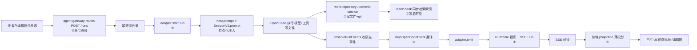

# 17 实现深读⑧：端到端串联与验收总表

> [!abstract] 这篇讲什么
> ①–⑦ 把每个模块拆开了。本篇把整条链路**串成一条线**，并给一张**验收自测总表**——你逐题答得上，就等于"小白也能看懂项目具体实现"，满足实习验收。配套复习 [[09 名词解释]] 与前面 7 篇。

---

## 1. 一条命令的完整一生（Mermaid 端到端）

---

## 2. 逐模块一句话回顾

| 篇 | 模块 | 一句话 |
|---|---|---|
| [[10 实现深读①]] | git/work-repository + commit-service | 作品目录骨架 + 所有写入唯一走 commit 服务（Keep/Undo/重命名/删除） |
| [[11 实现深读②]] | role + role-permissions | 六角色 + WRITE_SCOPE 目录限域 + 如何落地 OpenCode 权限 |
| [[12 实现深读③]] | adapter + delegation-flow + event-mapper | 命令→SessionV2.prompt；原生事件→产品事件；主编委派专家 |
| [[13 实现深读④]] | sse-frame + sse-hub + run-map + drain-admission + startup-reconciliation | 事件编码成帧、fan-out、并发 drain 限流、重启对账 |
| [[14 实现深读⑤]] | workbench + agent-gateway-routes | 只读作品树/文档投影 + 命令总线 8 action |
| [[15 实现深读⑥]] | search-index + work-index-sync + work-search | 每作品 SQLite 索引，写后可见/Undo 消失 |
| [[16 实现深读⑦]] | agent-chat/projection + three-pane-linkage | 薄投影 3 规则 + 三栏联动（左树/中编辑器/右洞察） |

---

## 3. 验收自测总表（答得上 = 通过）

### A. 作品存储与提交（①）
1. 作品出生做了哪两件事？（git init 裸仓 + 首提交）
2. AI 写文件最终落到哪个函数？作者保存草稿走的是同一个吗？
3. Keep 与 commit 的关系？Undo 怎么让文件"回到上一版"？
4. 为什么所有写入必须走 `commitService` 唯一门？（索引同步钩子依赖它）

### B. 角色与限域（②）
5. 六角色是哪六个？主管(supervisor)与专家(specialist)的区别？
6. `WRITE_SCOPE` 怎么限制"设定专家只能改设定目录"？
7. `editRulesFromWriteScope` 把角色权限翻译成了 OpenCode 的什么？

### C. 命令→Session 桥接（③）
8. 作者点发送到真正调模型，中间经哪几个函数？
9. `emit` 为什么是事件唯一出口？它做哪 4 件事？
10. `startRun` 的 steer 与 queue 两种模式区别？
11. 主会话里作者看到专家的全部 tool 调用还是摘要？为什么？

### D. SSE 与簿记（④）
12. 一条事件从 `emit` 到浏览器经过 sse-hub 哪两个结构？
13. 慢消费者熔断后前端怎么自愈？（重连 + snapshot）
14. `run-map` 把什么映射成什么？为什么需要它？
15. 进程重启后排队未跑的指令会丢吗？`reconcile` 怎么处理？

### E. HTTP API 与命令总线（⑤）
16. 命令总线 8 action 是哪 8 个？
17. 幂等键防止什么？重试发两次为何不重复执行？
18. 作者保存草稿最终写磁盘的函数？与 AI 同盘吗？

### F. 检索（⑥）
19. 每作品索引文件？表结构？
20. "写后可见/Undo 消失"靠哪段代码？

### G. 前端投影（⑦）
21. 前端投影三条铁律？completed 替换 delta 靠哪个字段？
22. 三栏共享哪四个作用域？哪条 BAN 保护"作者即裁判"？

---

## 4. 给实习生的下一步

- 想跑起来看真实链路：按 [[07 机器拓扑与红线]]，只在 Windows 开发机改代码，改完到 `192.168.31.35` 验证（只读，不编辑）。
- 想加新能力：先想清它属于哪一层（领域层 novel-core / 桥接 novel-server / 前端 novel-web），别越层。
- 任何写操作都要经过 ① 的 commit 服务，这样 ⑥ 索引、③ 投影才会自动一致。

> 验收达成标准：以上 22 题你都能用自己的话答出"函数名 + 它干什么 + 为什么这样设计"，即视为完全理解本项目实现。
