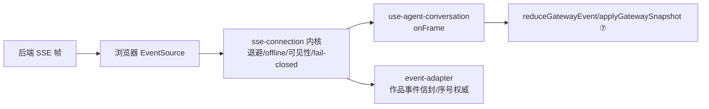

# 18 实现深读⑨：前端 SSE 订阅与投影驱动

> [!abstract] 这篇讲什么
> ④ 讲了后端怎么把事件变成 SSE 帧，⑦ 讲了前端 `projection.ts` 怎么把事件归约成状态。中间缺一块：**前端怎么打开 SSE 流、怎么在断线/切后台/授权失效时自愈、怎么把帧喂给投影**。答案在 `use-agent-conversation.ts`（Agent 流）+ `sse-connection.ts`（传输内核）+ `event-adapter.ts`（作品事件信封）。本篇补全 ④→⑦ 的最后一环。生词见 [[09 名词解释]]。

---

## 1. 三层分工（Mermaid）

---

## 2. Agent 流驱动（use-agent-conversation.ts）

### 2.1 `useAgentConversation`（use-agent-conversation.ts:38）—— 连接生命周期钩子
- **三条恒定**（注释 use-agent-conversation.ts:31）：**挂载取快照 → SSE live → 任何异常重连并重取快照**。
- 挂载时：`setTimeout(refreshSnapshot, 0)` 先拉快照（`applyGatewaySnapshot`，对应 ⑦ 的快照整体接管）；再 `subscribeSseStream` 开实时流。
- `onFrame`（use-agent-conversation.ts:79）：每帧 → `parseAgentConversationFrame`：
  - 解析失败 → 返回 `"reconnect"`（**坏帧不静默吞，必须回权威快照**，注释 use-agent-conversation.ts:81）。
  - `snapshot` 帧 → `parseGatewaySnapshot` + `applyGatewaySnapshot`（断线重连时整体接管）。
  - 普通事件 → `reduceGatewayEvent(state, event, time)`（⑦ 的归约器）。
- `onWake`（use-agent-conversation.ts:101）：断线/标签页恢复后调 `refreshSnapshot` 补齐竞态窗口（**不是逐帧追平，而是重取快照**）。
- 返回 `stateForConversation(state, conversationId)`（⑦ 的身份护栏，切会话即重置）+ `connection` 状态。

### 2.2 `parseAgentConversationFrame`（use-agent-conversation.ts:23）
- **做什么**：把原始帧文本解析成事件；解析异常返回 `{kind:"reconnect"}`——把"坏帧"翻译成"需要重连"信号，交给内核处理。

---

## 3. 传输内核（sse-connection.ts）

> [!note] 关键设计
> 两条产品流（作品事件 workbench、Agent 会话）共用**同一个** SSE 内核——传输策略（退避、offline 降级、可见性唤醒、授权 fail-closed）**只写一次**（注释 sse-connection.ts:1）。

### 3.1 `subscribeSseStream`（sse-connection.ts:249）
- **做什么**：工厂，创建 `SseStream` 并 `subscribe(listener)`，返回退订函数。

### 3.2 `SseStream` 类（sse-connection.ts:78）—— 连接状态机
- `connect()`（sse-connection.ts:204）：`env.createSource(url)` 建浏览器 `EventSource`；挂 `onopen`/`onmessage`/`onerror`。
  - `onmessage`：嗅探 `looksLikeAuthorizationLoss` → `failClosed`（授权丢失立即中止，绝不臆造成功）；否则交给 `handlers.onFrame`（返回 `"reconnect"` 则 `scheduleReconnect` + `scheduleWake(true)`）。
  - `onerror`：**不依赖浏览器内建重试**（CLOSED 后不再重连），统一由内核接管节奏（sse-connection.ts:235）。
- `scheduleReconnect()`（sse-connection.ts:159）：**有界指数退避** `min(30000, 500 * 2^(attempts-1))`——防止畸形事件导致 1s 热循环（注释 sse-connection.ts:36）。连续失败 ≥5 次（`RECONNECT_ATTEMPTS_BEFORE_OFFLINE`）→ 状态如实降级为 `offline`（sse-connection.ts:39，UI 不再谎称"重连中"）。
- `scheduleWake(gap)`（sse-connection.ts:124）：**80ms 合并唤醒**——多帧触发只重取一次快照（避免每事件一次全量 GET）。
- `onVisibilityChange`（sse-connection.ts:197）：标签页恢复可见 → `scheduleWake(true)` + `expediteReconnect`（**标签页休眠不算传输失败，不计入 attempts**）。
- `failClosed(reason)`（sse-connection.ts:113）：授权丢失/永久关闭 → 置 `revoked`，广播 `revoked` 给监听者，**无静默写路径**。

### 3.3 `looksLikeAuthorizationLoss`（sse-connection.ts:64）
- **做什么**：嗅探服务端下发的吊销信号（`authorization-revoked` / `status:401` / `status:403` 等），命中即 fail-closed。

---

## 4. 作品事件信封（event-adapter.ts）

### 4.1 `subscribeWorkbenchEvents` / `WorkbenchEventAdapter`（event-adapter.ts:175 / 56）
- **连接作用域 = work_id + branch_id only**（event-adapter.ts:37）——`objectId` 只是调用点元数据，**绝不另开第二条 EventSource**（多 surface 共享同一连接，SPC-UI-219）。
- `adapters` 是 `Map<key, adapter>`（event-adapter.ts:173）：同一 work/branch 的所有 UI 面板共享一个 adapter，订阅人数归零才真正断流。
- `start()`（event-adapter.ts:93）：`buildUrl` 带 `after=observedSequence` 游标（断点续传）；`onFrame` 用 `decideWorkbenchEventApply` 做**序号权威 + gap 检测**（event-adapter.ts:106）：正常帧 `observedSequence = decision.sequence` 并 `api.wake(gap)`；`invalid-scope`/`malformed` → `"reconnect"`（有界退避 + 全量刷新）。

### 4.2 `workbenchConnectionLabel`（event-adapter.ts:201）
- **做什么**：把连接状态翻成作者可读文案。`offline` 必须显示"连接中断"而非"正在重连"——否则作者以为推送马上恢复（注释 event-adapter.ts:199）。

> [!note] 与 ④ 的闭环
> 前端 `after=observedSequence` 游标 + 后端快照（`④` 的 `snapshot` 帧）+ 有界退避，正是 ④ 说的"断线以重连快照恢复"在前端的落地。序号权威在 adapter，传输内核只负责可靠送字节。

---

## 5. 自测

1. 前端打开 Agent SSE 流后，连接生命周期三条恒定是什么？（提示：挂载取快照→live→异常重连重取快照）
2. 一帧解析失败了，前端是忽略它还是重连？（提示：返回 reconnect，回权威快照）
3. `sse-connection` 的退避上限是多少？为什么要有上限？（提示：30s，防热循环）
4. 标签页休眠后恢复，算一次"传输失败"计入重连次数吗？（提示：不算，expediteReconnect 压缩退避）
5. 授权丢失（401/403）前端怎么处理？（提示：looksLikeAuthorizationLoss → failClosed → revoked，无静默写）
6. 作品事件流的连接键是哪两个字段？objectId 会另开连接吗？（提示：work_id+branch_id；不会，多面板共享）

> ⑨ 把 ④ SSE 与 ⑦ 投影真正接通。前端还有 ~70 个 `*-projection.ts`（三栏各细分能力，如左栏资源索引、右栏洞察十一区），属既定独立阶段，按需展开。
